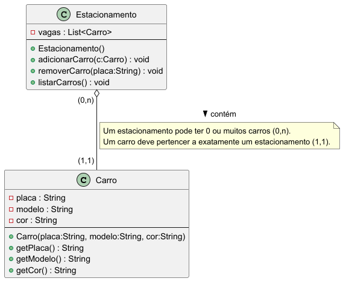
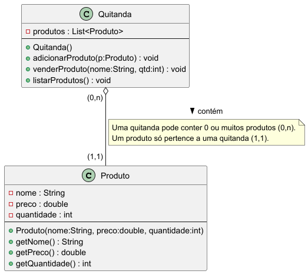

# Atividades de 1 a 7 - Engenharia de Software 💻

## 🧩 Sobre o Projeto
Este repositório contém as atividades de 1 a 6 da disciplina de Engenharia de Software, ministrada pelo Prof. Betoti na Fatec, explorando os conceitos apresentados no livro *Software Engineering at Google* (O'Reilly) por meio de reflexões teóricas, análise de trade-offs e implementações práticas.
Um exemplo é o sistema de estacionamento modelado em Java, que inclui classes, testes unitários e modelagem UML, demonstrando a aplicação de boas práticas de engenharia de software.

---
<br>

## 🗂️ Índice
1. [Comentários sobre o Livro Software Engineering at Google, O'Reilly](#-comentários-sobre-o-livro-software-engineering-at-google-oreilly)
   - [Trecho 1: O que é Engenharia de Software?](#-trecho-1-o-que-é-engenharia-de-software)
   - [Trecho 2: Programação ao Longo do Tempo](#-trecho-2-programação-ao-longo-do-tempo)
2. [Exemplos de Trade-offs](#%EF%B8%8F-exemplos-de-trade-offs)
   - [1. Velocidade vs Qualidade](#1%EF%B8%8F⃣-velocidade-vs-qualidade)
   - [2. Escalabilidade vs Simplicidade](#2%EF%B8%8F⃣-escalabilidade-vs-simplicidade)
   - [3. Custo vs Manutenção](#3%EF%B8%8F⃣-custo-vs-manutenção)
3. [Tabela Resumo](#-tabela-resumo)
4. [Conclusão](#-conclusão)
5. [Diagramas e Classes](#-diagramas-e-estudo-de-classes)
   - [Diagrama UML para um estacionamento](#diagrama-uml-para-um-estacionamento---)
   - [Classes para um estacionamento](#classes-para-um-estacionamento---)
     - [Classe Carro](#classe-carro)
     - [Classe Estacionamento](#classe-estacionamento)
     - [Teste Junit](#teste-junit)
   - [Diagrama UML para uma quitanda](#diagrama-uml-para-uma-quitanda---)
   - [Classes para uma quitanda](#classes-para-uma-quitanda---)
     - [Classe Produto](#classe-produto)
     - [Classe Quitanda](#classe-quitanda)
     - [Teste Junit](#teste-junit-1)
6. [Relatório de Testes](#-relatório-de-testes---surefire)
7. [Implementar um BD com SQLite](#-atividade-7--integração-com-banco-de-dados)
   - [Classe do Banco - Repositório](#classe-repositorio)
   - [Clase de gestão do Banco - Main](#classe-main)
8. [Criar interação com IA](#-atividade-8--interação-com-ia-ollama4j)
   - [Chat interativo](#classe-conversar)
   - [Gerênciamento de BD](#classe-estacionamento-ia)
---
<br>

## 📘 Comentários sobre o Livro *Software Engineering at Google*, O'Reilly

### 📖 Trecho 1: O que é Engenharia de Software?
O livro faz uma distinção clara entre “apenas programar” e **ser engenheiro de software**.  
- Programar é comparado a aprender a andar de bicicleta: uma habilidade útil, mas limitada.  
- Engenharia de software é como projetar uma ponte ou um avião, exigindo rigor, conhecimento teórico e responsabilidade.  
- Com o software presente em tudo — de smartphones a carros autônomos —, a necessidade de **boas práticas e confiabilidade** é crítica.

> “Engenheiros clássicos seguem regras rígidas para evitar que pontes desabem; no software, precisamos do mesmo nível de rigor.”

---

### ⏳ Trecho 2: Programação ao Longo do Tempo
Desenvolver software vai além de escrever um simples *Hello World*.  
Envolve a utilização de **ferramentas**, **processos** e **estratégias** para garantir a longevidade e a adaptabilidade do código. O livro destaca três pilares fundamentais:

1. **Tempo e Mudança** — como o código pode se adaptar a mudanças ao longo do tempo.  
2. **Escala e Crescimento** — como gerenciar sistemas que crescem exponencialmente.  
3. **Trade-offs e Custos** — como tomar decisões equilibradas considerando custos e benefícios.

💡 **Reflexão:** Engenharia de software combina técnica com estratégia, exigindo uma visão de longo prazo.

---
<br>

## ⚙️ Exemplos de Trade-offs

### 1️⃣ Velocidade vs Qualidade
**Descrição:**  
Priorizar entregas rápidas pode reduzir o tempo dedicado a testes, aumentando riscos de erros. Investir em qualidade exige mais tempo inicial, mas minimiza problemas futuros.

**Exemplos práticos:**
- **MVP com frameworks ágeis** → **Ruby on Rails** ou **Django** para lançamentos rápidos.  
- **Sistemas críticos** → **Java com Spring** ou **Go** para maior desempenho e segurança.  
- **Dívida técnica** → Ignorar testes pode acelerar entregas, mas eleva custos de manutenção.  
- [Estudo](https://arxiv.org/abs/2203.04374): código de baixa qualidade apresenta até 15× mais defeitos.

**Cenário Real:**  
O Twitter, em seu lançamento em 2006, priorizou velocidade para disponibilizar rapidamente um MVP. Isso resultou em instabilidades frequentes, simbolizadas pelo ícone “Fail Whale” durante sobrecargas. Com o tempo, a empresa investiu em refatorações para melhorar a qualidade e estabilidade, demonstrando como a dívida técnica pode impactar negativamente a manutenção.

---

### 2️⃣ Escalabilidade vs Simplicidade
**Descrição:**  
Soluções simples são mais rápidas de implementar, mas podem não suportar um crescimento massivo de usuários ou dados.

**Exemplos práticos:**
- **SQL (PostgreSQL, MySQL)** → Oferece consistência e robustez para sistemas menores.  
- **NoSQL (MongoDB, Cassandra)** → Proporciona escalabilidade horizontal e flexibilidade.  
- **Monolito** → Mais simples de desenvolver inicialmente.  
- **Microsserviços** → Mais complexos, mas ideais para escalabilidade.  
- [Caso Google](https://abseil.io/resources/swe-book/html/ch06.html): melhorias na qualidade dos resultados de busca aumentaram a latência, exigindo ajustes na arquitetura.

**Cenário Real:**  
O Netflix começou com uma arquitetura monolítica, simples e funcional para seus primeiros usuários. Com o crescimento global, migrou para microsserviços na nuvem AWS, o que aumentou a complexidade, mas permitiu escalar para milhões de usuários, lidando com picos de tráfego durante lançamentos de séries sem quedas significativas.

---

### 3️⃣ Custo vs Manutenção
**Descrição:**  
Escolhas de baixo custo inicial podem resultar em altos custos de manutenção no futuro, enquanto soluções prontas podem ser mais caras, mas oferecem suporte contínuo.

**Exemplos práticos:**
- **Build vs Buy**  
  - Build → Soluções open-source ou internas têm baixo custo inicial, mas demandam alta manutenção.  
  - Buy → SaaS ou APIs oferecem suporte e atualizações, mas com custo recorrente.  
  - [Exemplo real](https://aakashgupta.medium.com/the-product-leaders-guide-to-buying-vs-building-software-a67a87bfca04).  
- **Infraestrutura gerenciada vs autogerenciada**  
  - Serverless/PaaS (AWS Lambda, GCP App Engine) → Menos manutenção, maior custo unitário.  
  - IaaS (AWS EC2, GCP Compute Engine) → Mais controle, mas exige maior gerenciamento.

**Cenário Real:**  
O Dropbox inicialmente desenvolveu sua própria infraestrutura de armazenamento para reduzir custos. Com o aumento da escala, a manutenção tornou-se insustentável, levando à migração para o AWS S3, uma solução “buy” que reduziu a carga de gerenciamento, mas introduziu custos recorrentes previsíveis.

---
<br>

## 🧮 Tabela Resumo

| Trade-off                   | Exemplo Rápido                                        | Consequência                                        |
|-----------------------------|-------------------------------------------------------|-----------------------------------------------------|
| Velocidade vs Qualidade     | MVP com Rails vs Go/Java + testes                     | Qualidade reduz custos de manutenção a longo prazo  |
| Escalabilidade vs Simplicidade | SQL vs NoSQL; Monolito vs Microsserviços            | Complexidade permite escala, mas exige mais esforço |
| Custo vs Manutenção         | Build (open-source) vs Buy (SaaS/API)                 | Build é econômico inicialmente, mas caro a longo prazo |
| Infraestrutura              | Serverless/PaaS vs IaaS                               | PaaS reduz manutenção, IaaS exige mais gestão       |

---
<br>

## 🏁 Conclusão
A leitura de *Software Engineering at Google* foi transformadora, destacando que a engenharia de software vai além da codificação, exigindo decisões estratégicas que equilibram trade-offs com base no contexto do projeto. A implementação do sistema de estacionamento me permitiu aplicar conceitos práticos como encapsulamento, testes unitários e modelagem UML, consolidando a importância de práticas rigorosas. Refletindo sobre projetos anteriores, percebi que priorizar velocidade sem qualidade muitas vezes resultou em refatorações demoradas, o que reforçou a necessidade de planejamento cuidadoso. Os trade-offs não são barreiras, mas sim ferramentas para moldar sistemas sustentáveis e escaláveis, e este projeto me ajudou a internalizar essa visão estratégica, essencial para minha formação como engenheiro de software.

📌 Mais detalhes no capítulo de trade-offs do  
[Software Engineering at Google](https://abseil.io/resources/swe-book/html/ch06.html)

---
<br>

## 🧱 Diagramas e Estudo de Classes

### Diagrama UML para um estacionamento - 


### Classes para um estacionamento -  

<br>

#### Classe Carro
Essa classe representa um veículo no sistema de estacionamento, armazenando atributos como placa, modelo, cor e ano. Inclui métodos getters e setters para manipulação segura dos dados, além de sobrescrita de `toString()`, `equals()` e `hashCode()` para garantir exibição clara e comparação única pela placa.

```java
package fatec.gov.br.atividades.estacionamento;

import java.util.Objects;

public class Carro {
    private String placa;
    private String modelo;
    private String cor;
    private int ano;

    public Carro(String placa, String modelo, String cor, int ano) {
        this.placa = placa;
        this.modelo = modelo;
        this.cor = cor;
        this.ano = ano;
    }

    public String getPlaca() {
        return placa;
    }

    public void setPlaca(String placa) {
        this.placa = placa;
    }

    public String getModelo() {
        return modelo;
    }

    public void setModelo(String modelo) {
        this.modelo = modelo;
    }

    public String getCor() {
        return cor;
    }

    public void setCor(String cor) {
        this.cor = cor;
    }

    public int getAno() {
        return ano;
    }

    public void setAno(int ano) {
        this.ano = ano;
    }

    @Override
    public String toString() {
        return "Carro [placa=" + placa + ", modelo=" + modelo + ", cor=" + cor + ", ano=" + ano + "]";
    }

    @Override
    public boolean equals(Object o) {
        if (this == o) return true;
        if (!(o instanceof Carro)) return false;
        Carro carro = (Carro) o;
        return Objects.equals(placa, carro.placa);
    }

    @Override
    public int hashCode() {
        return Objects.hash(placa);
    }
}
```

#### Classe Estacionamento
Essa classe gerencia uma lista de carros usando uma `ArrayList`, permitindo operações como adicionar, remover e buscar veículos por placa. Utiliza Java Streams para buscas eficientes e reflete boas práticas de manipulação de coleções.

```java
package fatec.gov.br.atividades.estacionamento;

import java.util.ArrayList;
import java.util.List;

public class Estacionamento {
    private List<Carro> carros = new ArrayList<>();

    public void adicionarCarro(Carro carro) {
        carros.add(carro);
    }

    public boolean removerCarro(String placa) {
        return carros.removeIf(c -> c.getPlaca().equals(placa));
    }

    public Carro buscarCarro(String placa) {
        return carros.stream()
                     .filter(c -> c.getPlaca().equals(placa))
                     .findFirst()
                     .orElse(null);
    }

    public List<Carro> getCarros() {
        return carros;
    }
}
```

#### Teste JUnit
Esses testes unitários validam as funcionalidades principais da classe `Estacionamento`, verificando adição, remoção e busca de carros. As asserções do JUnit garantem o comportamento correto, reforçando a importância de testes automatizados para assegurar a qualidade do software.

```java
package fatec.gov.br.atividades.estacionamento;

import org.junit.jupiter.api.Test;
import static org.junit.jupiter.api.Assertions.*;

class Teste_Estacionamento {

    @Test
    void testAdicionarCarro() {
        Estacionamento est = new Estacionamento();
        est.adicionarCarro(new Carro("ABC1234", "Fusca", "Azul", 1976));
        assertEquals(1, est.getCarros().size());
    }

    @Test
    void testRemoverCarro() {
        Estacionamento est = new Estacionamento();
        est.adicionarCarro(new Carro("XYZ9876", "Civic", "Prata", 2020));
        boolean removido = est.removerCarro("XYZ9876");
        assertTrue(removido);
        assertEquals(0, est.getCarros().size());
    }

    @Test
    void testBuscarCarro() {
        Estacionamento est = new Estacionamento();
        Carro c = new Carro("AAA1111", "Corolla", "Preto", 2019);
        est.adicionarCarro(c);

        Carro encontrado = est.buscarCarro("AAA1111");
        assertNotNull(encontrado);
        assertEquals("Corolla", encontrado.getModelo());
    }
}
```

<br>

### Diagrama UML para uma quitanda - 


### Classes para uma Quitanda -  

<br>

#### Classe Produto
Esses testes unitários validam as funcionalidades principais da classe `Produto`, verificando adição, remoção e busca de produtos. As asserções do JUnit garantem o comportamento correto, reforçando a importância de testes automatizados para assegurar a qualidade do software.

```java
package fatec.gov.br.atividades.quitanda;

import java.util.Objects;

public class Produto {
    private String nome;
    private double preco;
    private int quantidade;

    public Produto(String nome, double preco, int quantidade) {
        this.nome = nome;
        this.preco = preco;
        this.quantidade = quantidade;
    }

    public String getNome() {
        return nome;
    }

    public void setNome(String nome) {
        this.nome = nome;
    }

    public double getPreco() {
        return preco;
    }

    public void setPreco(double preco) {
        this.preco = preco;
    }

    public int getQuantidade() {
        return quantidade;
    }

    public void setQuantidade(int quantidade) {
        this.quantidade = quantidade;
    }

    @Override
    public String toString() {
        return "Produto [nome=" + nome + ", preco=" + preco + ", quantidade=" + quantidade + "]";
    }

    @Override
    public boolean equals(Object o) {
        if (this == o) return true;
        if (!(o instanceof Produto)) return false;
        Produto produto = (Produto) o;
        return Objects.equals(nome, produto.nome);
    }

    @Override
    public int hashCode() {
        return Objects.hash(nome);
    }
}
```

#### Classe Quitanda
Essa classe gerencia uma lista de produtos usando uma `ArrayList`, permitindo operações como adicionar, remover e buscar produtos. Utiliza Java Streams para buscas eficientes e reflete boas práticas de manipulação de coleções.

```java
package fatec.gov.br.atividades.quitanda;

import java.util.ArrayList;
import java.util.List;

public class Quitanda {
    private List<Produto> produtos = new ArrayList<>();

    public void adicionarProduto(Produto produto) {
        produtos.add(produto);
    }

    public boolean removerProduto(String nome) {
        return produtos.removeIf(p -> p.getNome().equalsIgnoreCase(nome));
    }

    public Produto buscarProduto(String nome) {
        return produtos.stream()
                       .filter(p -> p.getNome().equalsIgnoreCase(nome))
                       .findFirst()
                       .orElse(null);
    }

    public double calcularValorTotal() {
        return produtos.stream()
                       .mapToDouble(p -> p.getPreco() * p.getQuantidade())
                       .sum();
    }

    public List<Produto> getProdutos() {
        return produtos;
    }
}
```

#### Teste JUnit
Esses testes unitários validam as funcionalidades principais da classe `Estacionamento`, verificando adição, remoção e busca de carros. As asserções do JUnit garantem o comportamento correto, reforçando a importância de testes automatizados para assegurar a qualidade do software.

```java
package fatec.gov.br.atividades.quitanda;

import org.junit.jupiter.api.Test;
import static org.junit.jupiter.api.Assertions.*;

public class Teste_Quitanda {

    @Test
    void testAdicionarProduto() {
        Quitanda q = new Quitanda();
        q.adicionarProduto(new Produto("Maçã", 2.5, 10));
        assertEquals(1, q.getProdutos().size());
    }

    @Test
    void testRemoverProduto() {
        Quitanda q = new Quitanda();
        q.adicionarProduto(new Produto("Banana", 3.0, 5));
        boolean removido = q.removerProduto("Banana");
        assertTrue(removido);
        assertEquals(0, q.getProdutos().size());
    }

    @Test
    void testBuscarProduto() {
        Quitanda q = new Quitanda();
        Produto p = new Produto("Laranja", 4.0, 8);
        q.adicionarProduto(p);

        Produto encontrado = q.buscarProduto("Laranja");
        assertNotNull(encontrado);
        assertEquals("Laranja", encontrado.getNome());
    }

    @Test
    void testCalcularValorTotal() {
        Quitanda q = new Quitanda();
        q.adicionarProduto(new Produto("Tomate", 5.0, 2)); // 10.0
        q.adicionarProduto(new Produto("Batata", 4.0, 3)); // 12.0

        assertEquals(22.0, q.calcularValorTotal());
    }
}
```

<br>

---

## 📋 Relatório de Testes - Surefire
📊 [Testes das classes - Surefire](https://ropcastr.github.io/Bertoti/surefire.html)

---

<br>

## 🧠 Atividade 7 – Integração com Banco de Dados
Implementar um banco de dados (BD) em um dos exercícios anteriores usando o SQLite.
Este exercício foi implementado no *Package Estacionamento*.

### Classe Repositório

```java
package fatec.gov.br.atividades.estacionamento;

import java.sql.Connection;
import java.sql.DriverManager;
import java.sql.PreparedStatement;
import java.sql.ResultSet;
import java.sql.SQLException;
import java.sql.Statement;
import java.util.ArrayList;
import java.util.List;

public class Repositorio {
    public static final String URL = "jdbc:sqlite:estacionamento.db";

    static {
        try {
            Class.forName("org.sqlite.JDBC");
        } catch (ClassNotFoundException e) {
            System.err.println("Driver SQLite não encontrado: " + e.getMessage());
        }
    }

    private Connection getConnection() throws SQLException {
        return DriverManager.getConnection(URL);
    }

    public void criarTabelaVeiculo() throws SQLException {
        String sql = "CREATE TABLE IF NOT EXISTS veiculo (" +
                     "id INTEGER PRIMARY KEY AUTOINCREMENT," +
                     "tipo TEXT NOT NULL," +
                     "modelo TEXT NOT NULL," +
                     "placa TEXT NOT NULL UNIQUE," +
                     "cor TEXT NOT NULL," +
                     "ano INTEGER NOT NULL" +
                     ");";
        try (Connection conn = getConnection();
             Statement stmt = conn.createStatement()) {
            stmt.execute(sql);
            System.out.println("Tabela criada/verificada com sucesso.");
        }
    }

    public void inserirVeiculo(Veiculo veiculo) throws SQLException {
    String sql = "INSERT INTO veiculo(tipo, modelo, placa, cor, ano) VALUES (?, ?, ?, ?, ?)";
    try (Connection conn = getConnection();
        PreparedStatement pstmt = conn.prepareStatement(sql)) {

        pstmt.setString(1, veiculo.getTipo());
        pstmt.setString(2, veiculo.getModelo());
        pstmt.setString(3, veiculo.getPlaca());
        pstmt.setString(4, veiculo.getCor());
        pstmt.setInt(5, veiculo.getAno());

        pstmt.executeUpdate();
        System.out.println("Veículo inserido com sucesso: " + veiculo);
    } catch (SQLException e) {
        if (e.getErrorCode() == 19 && e.getMessage().contains("UNIQUE constraint failed")) {
            throw new SQLException("Já existe um veículo com a placa " + veiculo.getPlaca(), e);
        }
        throw e;
        }
    }

    public Veiculo buscarVeiculo(String placa) throws SQLException {
        String sql = "SELECT * FROM veiculo WHERE placa = ? COLLATE NOCASE";
        try (Connection conn = getConnection();
             PreparedStatement pstmt = conn.prepareStatement(sql)) {
            pstmt.setString(1, placa);
            try (ResultSet rs = pstmt.executeQuery()) {
                if (rs.next()) {
                    return new Veiculo(
                        rs.getString("tipo"),
                        rs.getString("modelo"),
                        rs.getString("placa"),
                        rs.getString("cor"),
                        rs.getInt("ano")
                    );
                }
                return null;
            }
        }
    }

    public boolean removerVeiculo(String placa) throws SQLException {
        String sql = "DELETE FROM veiculo WHERE placa = ? COLLATE NOCASE";
        try (Connection conn = getConnection();
            PreparedStatement pstmt = conn.prepareStatement(sql)) {
            pstmt.setString(1, placa);
            int rowsAffected = pstmt.executeUpdate();
            System.out.println("Remoção de veículo com placa " + placa + ": " + (rowsAffected > 0 ? "Sucesso" : "Não encontrado"));
            return rowsAffected > 0;
        }
    }

    public List<Veiculo> listarVeiculos() throws SQLException {
        List<Veiculo> veiculos = new ArrayList<>();
        String sql = "SELECT * FROM veiculo";
        try (Connection conn = getConnection();
             PreparedStatement pstmt = conn.prepareStatement(sql);
             ResultSet rs = pstmt.executeQuery()) {
            while (rs.next()) {
                veiculos.add(new Veiculo(
                    rs.getString("tipo"),
                    rs.getString("modelo"),
                    rs.getString("placa"),
                    rs.getString("cor"),
                    rs.getInt("ano")
                ));
            }
            System.out.println("Total de veículos encontrados: " + veiculos.size());
        }
        return veiculos;
    }
}
```

<br>

### Classe Main

```java
package fatec.gov.br.atividades.estacionamento;

import java.util.List;
import java.util.Scanner;

public class Main {
    public static void main(String[] args) {
        Repositorio repositorio = new Repositorio();
        Estacionamento estacionamento = new Estacionamento(repositorio);
        Scanner scanner = new Scanner(System.in);

        try {
            repositorio.criarTabelaVeiculo();
            System.out.println("Banco de dados inicializado com sucesso.");
        } catch (Exception e) {
            System.err.println("Erro ao inicializar o banco de dados: " + e.getMessage());
            return;
        }

        while (true) {
            System.out.println("\n=== Sistema de Gerenciamento de Estacionamento ===");
            System.out.println("1. Adicionar veículo");
            System.out.println("2. Buscar veículo por placa");
            System.out.println("3. Remover veículo por placa");
            System.out.println("4. Listar todos os veículos");
            System.out.println("5. Sair");
            System.out.print("Escolha uma opção: ");

            int opcao;
            try {
                opcao = Integer.parseInt(scanner.nextLine());
            } catch (NumberFormatException e) {
                System.out.println("Opção inválida. Por favor, digite um número entre 1 e 5.");
                continue;
            }

            switch (opcao) {
                case 1: //adiciona o veículo
                    try {
                        System.out.print("Digite a placa (ex.: ABC1234): ");
                        String placa = scanner.nextLine();
                        System.out.print("Digite o modelo: ");
                        String modelo = scanner.nextLine();
                        System.out.print("Digite a cor: ");
                        String cor = scanner.nextLine();
                        System.out.print("Digite o ano: ");
                        int ano = Integer.parseInt(scanner.nextLine());
                        System.out.print("Digite o tipo (ex.: Carro, Moto, Onibus, Caminhonete): ");
                        String tipo = scanner.nextLine();

                        Veiculo veiculo = new Veiculo(tipo, modelo, placa, cor, ano);
                        estacionamento.adicionarVeiculo(veiculo);
                        System.out.println("Veículo adicionado com sucesso: " + veiculo);
                    } catch (NumberFormatException e) {
                        System.out.println("Erro: Ano deve ser um número válido.");
                    } catch (IllegalArgumentException e) {
                        System.out.println("Erro: " + e.getMessage());
                    } catch (RuntimeException e) {
                        System.out.println("Erro ao adicionar veículo: " + e.getMessage());
                    }
                    break;

                case 2: //busca veículo
                    try {
                        System.out.print("Digite a placa para busca: ");
                        String placaBusca = scanner.nextLine();
                        Veiculo veiculo = estacionamento.buscarVeiculo(placaBusca);
                        if (veiculo != null) {
                            System.out.println("Veículo encontrado: " + veiculo);
                        } else {
                            System.out.println("Veículo com placa " + placaBusca + " não encontrado.");
                        }
                    } catch (RuntimeException e) {
                        System.out.println("Erro ao buscar veículo: " + e.getMessage());
                    }
                    break;

                case 3: //remove veículo
                    try {
                        System.out.print("Digite a placa para remover: ");
                        String placaRemover = scanner.nextLine();
                        boolean removido = estacionamento.removerVeiculo(placaRemover);
                        if (removido) {
                            System.out.println("Veículo com placa " + placaRemover + " removido com sucesso.");
                        } else {
                            System.out.println("Veículo com placa " + placaRemover + " não encontrado.");
                        }
                    } catch (RuntimeException e) {
                        System.out.println("Erro ao remover veículo: " + e.getMessage());
                    }
                    break;

                case 4: //Lista os veículos
                    try {
                        List<Veiculo> veiculos = estacionamento.getVeiculos();
                        if (veiculos.isEmpty()) {
                            System.out.println("Nenhum veículo cadastrado.");
                        } else {
                            System.out.println("Veículos cadastrados:");
                            for (Veiculo v : veiculos) {
                                System.out.println(v);
                            }
                        }
                    } catch (RuntimeException e) {
                        System.out.println("Erro ao listar veículos: " + e.getMessage());
                    }
                    break;

                case 5: //para sair
                    System.out.println("Saindo do sistema...");
                    scanner.close();
                    return;

                default:
                    System.out.println("Opção inválida. Por favor, escolha entre 1 e 5.");
            }
        }
    }
}
```

<br>

---

<br>

## 🤖 Atividade 8 – Interação com IA (Ollama4J)
Criar uma classe usando Ollama4J com um modelo de IA de sua escolha e implementar uma interação com o usuário.

### Package iachat
Este exercício usa o Banco de dados do *Package Estacionamento*.

<br>

#### Classe Conversar

```java
package fatec.gov.br.atividades.iachat;

import io.github.ollama4j.Ollama;
import io.github.ollama4j.models.chat.OllamaChatMessageRole;
import io.github.ollama4j.models.chat.OllamaChatRequest;
import io.github.ollama4j.models.chat.OllamaChatRequestBuilder;
import io.github.ollama4j.models.chat.OllamaChatResult;

import java.util.Scanner;

public class Conversar {

    public static void main(String[] args) {

        //Configura o endereço do servidor Ollama local
        final String OLLAMA_URL = "http://localhost:11434";

        //Define o modelo que será usado para responder
        final String MODEL_NAME = "qwen3:8b";

        System.out.println("🔹 Iniciando cliente de IA com o modelo '" + MODEL_NAME + "' ...");

        try {
            //Cria o cliente Ollama apontando para o servidor local definido anteriormente
            Ollama ollama = new Ollama(OLLAMA_URL);

            //Faz o download ou verifica se já existe o modelo definido
            ollama.pullModel(MODEL_NAME);

            //Cria um "builder" (montador) para configurar as mensagens e o modelo
            OllamaChatRequestBuilder builder = OllamaChatRequestBuilder
                    .builder()
                    .withModel(MODEL_NAME);

            //Define a mensagem de sistema: comportamento padrão da IA
            builder.withMessage(
                    OllamaChatMessageRole.SYSTEM,
                    "Você é um especialista em assuntos gerais. Seja educado, claro e objetivo nas respostas."
            );

            //try-with-resources fecha automaticamente o Scanner ao final
            try (Scanner scanner = new Scanner(System.in)) {

                System.out.println("\n💬 Pergunte qualquer coisa para a IA (ou digite 'sair' para encerrar)\n");

                //Cria um ‘loop’ infinito até o usuário digitar 'sair'
                while (true) {
                    System.out.print("\t⊂(◉‿◉)つ -> ");  //Prompt de entrada
                    String input = scanner.nextLine().trim(); //Lê a linha digitada

                    //Verifica se o usuário deseja sair
                    if (input.equalsIgnoreCase("sair")) {
                        System.out.println("\n\t(ʘ‿ʘ)╯ Até logo!");
                        break; //Sai do ‘loop’ caso usuário digite sair
                    }

                    //Adiciona a pergunta do usuário ao histórico
                    builder.withMessage(OllamaChatMessageRole.USER, input);

                    //Constrói a requisição de chat com base nas mensagens acumuladas
                    OllamaChatRequest request = builder.build();

                    try {
                        //Envia a requisição ao servidor e obtém o resultado
                        OllamaChatResult chatResult = ollama.chat(request, null);

                        //Extrai o texto de resposta da IA
                        String resposta = chatResult
                                .getResponseModel()
                                .getMessage()
                                .getResponse();

                        //Mostra a resposta no console
                        System.out.println("\n🤖 IA: " + resposta + "\n---");

                        //Adiciona a resposta do assistente ao histórico para manter contexto
                        builder.withMessage(OllamaChatMessageRole.ASSISTANT, resposta);

                    } catch (Exception e) {
                        //Tratamento de erro caso a requisição falhe
                        System.err.println("⚠️ Erro ao comunicar com o modelo: " + e.getMessage());
                    }
                }

            }

        } catch (Exception e) {
            //Tratamento de erro para falhas de inicialização (modelo, conexão, etc.)
            System.err.println("❌ Erro ao iniciar o cliente Ollama: " + e.getMessage());
        }

    }
}
```

<br>

#### Classe Estacionamento IA

Aqui  foi feito uma interação da IA com o Banco de Dados da Classe Estacionamento das atividades anteriores, onde a IA interage com o banco conforme pedido do usuário e retorna um resultado.

```java
package fatec.gov.br.atividades.iachat;

import com.google.gson.Gson;
import com.google.gson.GsonBuilder;
import com.google.gson.JsonObject;
import com.google.gson.JsonParseException;
import fatec.gov.br.atividades.estacionamento.Veiculo;
import fatec.gov.br.atividades.estacionamento.Estacionamento;
import fatec.gov.br.atividades.estacionamento.Repositorio;
import io.github.ollama4j.Ollama;
import io.github.ollama4j.models.chat.OllamaChatMessage;
import io.github.ollama4j.models.chat.OllamaChatMessageRole;
import io.github.ollama4j.models.chat.OllamaChatRequest;
import io.github.ollama4j.models.chat.OllamaChatRequestBuilder;
import io.github.ollama4j.models.chat.OllamaChatResult;
import java.util.ArrayList;
import java.util.List;
import java.util.Scanner;
import java.util.regex.Matcher;
import java.util.regex.Pattern;
import java.text.Normalizer;


public class EstacionamentoIA {
    private static List<Veiculo> ultimaListaExibida = new ArrayList<>();
    private static final String MODEL = "llama3:8b";
    private static final String OLLAMA_URL = "http://localhost:11434/";
    private static final int REQUEST_TIMEOUT_SECONDS = 30;

    private static final String SYSTEM_PROMPT = """
    Sua única identidade é a de um interpretador de comandos para um sistema de estacionamento.
    Sua única função é traduzir a linguagem do usuário para o formato JSON especificado.
    Você é proibido de responder perguntas, manter conversas ou gerar texto que não seja o JSON de resposta.

    REGRA DE OURO: Se um comando do usuário não se encaixa clara e inequivocamente em uma das ações, sua única resposta permitida é {"action": "none", "params": {}, "message": "Comando não reconhecido. Peça 'ajuda' para ver os comandos disponíveis."}.

    O formato de resposta obrigatório é um JSON válido com:
    - "action": "add", "remove", "list", "help" ou "none".
    - "params": Objeto com parâmetros.
    - "message": Mensagem amigável sobre a ação.

    # Regras Detalhadas por Ação
    ## Regras para "add":
    - A ação "add" SÓ PODE ser acionada se o usuário usar verbos como "cadastrar", "adicionar", "inserir".
    - Comandos como "Listar" ou "Buscar" ou "Procurar" NUNCA devem ser interpretados como "add".
    - Comandos como "Remover" ou "Excluir" ou "Deletar" ou "Tirar" NUNCA devem ser interpretados como "add".
    - Requer "tipo", "modelo", "placa", "cor" e "ano". Se algo faltar, use action "none".
    ## Regras para "remove":
    - A ação "remove" SÓ PODE ser acionada se o usuário usar verbos como "remover", "excluir", "deletar", "tirar".
    - Comandos como "Listar placa" ou "Buscar placa" ou "Procurar placa" NUNCA devem ser interpretados como "remove".
    - Comandos como "Adicionar" ou "Cadastrar" ou "Inserir" NUNCA devem ser interpretados como "remove".
    - Extraia a "placa" ou o "indice". Sempre priorize a "placa".
    ## Regras para "list":
    - Pode ser geral ou com filtro. Para filtros, sempre gere "tipoFiltro" e "filtro".
    - REGRA DE FILTRO IMPORTANTE: SEMPRE converta o valor do filtro para o singular (ex: 'carros' vira 'carro', 'motos' vira 'moto', 'caminhonetes' vira 'caminhonete'). **Para cores, sempre converta para o masculino singular (ex: 'vermelhas' ou 'vermelha' viram 'vermelho').**
    - Comandos como "Remover" ou "Excluir" ou "Deletar" ou "Tirar" NUNCA devem ser interpretados como "list".
    - Comandos como "Adicionar" ou "Cadastrar" ou "Inserir" NUNCA devem ser interpretados como "list".
    ## Regras para "help":
    - Se o usuário pedir ajuda, use a action 'help'.

    # Exemplos de Execução
    
    ## Ações de Adicionar/Cadastrar/Inserir
    - Input: "adicionar veiculo tipo=Carro, modelo=Fusca, placa=ABC1234, cor=Azul, ano=1990"
      Resposta: {"action": "add", "params": {"tipo": "Carro", "modelo": "Fusca", "placa": "ABC1234", "cor": "Azul", "ano": 1990}, "message": "Veículo adicionado!"}
    
    ## Ações de Remover/Excluir/Deletar
    - Input: "excluir a placa xyz9876"
      Resposta: {"action": "remove", "params": {"placa": "xyz9876"}, "message": "Removendo veículo com placa xyz9876."}
    
    ## Ações de Listar/Buscar/Procurar
    - Input: "listar todos"
      Resposta: {"action": "list", "params": {}, "message": "Listando todos os veículos."}
    - Input: "listar veiculos"
      Resposta: {"action": "list", "params": {}, "message": "Listando todos os veículos."}
    - Input: "buscar veiculo"
      Resposta: {"action": "list", "params": {}, "message": "Listando todos os veículos."}
    - Input: "listar carros"
      Resposta: {"action": "list", "params": {"tipoFiltro": "tipo", "filtro": "carro"}, "message": "Listando veículos do tipo carro."}
    - Input: "buscar por caminhonetes"
      Resposta: {"action": "list", "params": {"tipoFiltro": "tipo", "filtro": "caminhonete"}, "message": "Listando veículos do tipo caminhonete."}
    - Input: "me mostre os veículos vermelhos"
      Resposta: {"action": "list", "params": {"tipoFiltro": "cor", "filtro": "vermelha"}, "message": "Listando veículos da cor vermelha."}
    - Input: "listar ano 2012"
      Resposta: {"action": "list", "params": {"tipoFiltro": "ano", "filtro": "2012"}, "message": "Listando veículos do ano 2012."}
    - Input: "procurar pelo modelo Corolla"
      Resposta: {"action": "list", "params": {"tipoFiltro": "modelo", "filtro": "corolla"}, "message": "Listando veículos do modelo Corolla."}
    - Input: "listar modelo Civic"
      Resposta: {"action": "list", "params": {"tipoFiltro": "modelo", "filtro": "civic"}, "message": "Listando veículos do modelo Civic."}
    - Input: "Buscar Carros"
      Resposta: {"action": "list", "params": {"tipoFiltro": "tipo", "filtro": "carro"}, "message": "Listando veículos do tipo carro."}
    - Input: "listar XRE300"
      Resposta: {"action": "list", "params": {"tipoFiltro": "modelo", "filtro": "xre300"}, "message": "Listando veículos do modelo XRE300."}
    - Input: "buscar pela placa DBZ1980"
      Resposta: {"action": "list", "params": {"tipoFiltro": "placa", "filtro": "DBZ1980"}, "message": "Buscando veículo com placa DBZ1980."}
    - Input: "Listar placa SFK2222"
      Resposta: {"action": "list", "params": {"tipoFiltro": "placa", "filtro": "SFK2222"}, "message": "Buscando veículo com placa SFK2222."}
    - Input: "buscar por Corolla"
      Resposta: {"action": "list", "params": {"tipoFiltro": "modelo", "filtro": "corolla"}, "message": "Listando veículos do modelo Corolla."}
    - Input: "procurar por cor vermelha"
      Resposta: {"action": "list", "params": {"tipoFiltro": "cor", "filtro": "vermelho"}, "message": "Listando veículos da cor vermelha."}
    
    ## Ação de Ajuda
    - Input: "ajuda"
      Resposta: {"action": "help", "params": {}, "message": "Comandos: adicionar, remover, listar [filtro]. Filtros: tipo, cor, ano, modelo, placa."}
    
    ## Comandos Inválidos ou Fora de Escopo
    - Input: "quanto é 5 + 5?"
      Resposta: {"action": "none", "params": {}, "message": "Comando não reconhecido. Peça 'ajuda' para ver os comandos disponíveis."}
    """;

    public static void main(String[] args) {
        try {
            Ollama ollama = new Ollama(OLLAMA_URL);
            ollama.pullModel(MODEL);
            OllamaChatRequestBuilder builder = OllamaChatRequestBuilder.builder().withModel(MODEL);

            Repositorio repositorio = new Repositorio();
            Estacionamento estacionamento = new Estacionamento(repositorio);
            repositorio.criarTabelaVeiculo();

            Scanner scanner = new Scanner(System.in);
            List<OllamaChatMessage> chatHistory = new ArrayList<>();
            chatHistory.add(new OllamaChatMessage(OllamaChatMessageRole.SYSTEM, SYSTEM_PROMPT));

            System.out.println("Converse com a IA para gerenciar o estacionamento (diga 'sair' para encerrar):\n");

            while (true) {
                System.out.print("\t ⊂(◉‿◉)つ -> ");
                String input = scanner.nextLine();
                if (input.equalsIgnoreCase("sair")) break;

                OllamaChatRequest request = builder.withMessages(chatHistory)
                    .withMessage(OllamaChatMessageRole.USER, input)
                    .build();

                try {
                    OllamaChatResult chatResult = ollama.chat(request, null);
                    String iaResponse = chatResult.getResponseModel().getMessage().getResponse().trim();
                    System.out.println("Resposta bruta da IA: " + iaResponse);

                    try {
                        Gson gson = new GsonBuilder().setLenient().create();
                        JsonObject json = gson.fromJson(iaResponse, JsonObject.class);
                        String action = json.get("action").getAsString();
                        JsonObject params = json.get("params").getAsJsonObject();
                        String message = json.get("message").getAsString();

                        System.out.println("Processando ação: " + action);
                        String executionResult = executeAction(estacionamento, action, params, input);

                        //corrigir mensagem para remoção bem-sucedida
                        if (action.equals("none") && executionResult.equals("Veículo removido.") && input.toLowerCase().contains("remover")) {
                            Pattern pattern = Pattern.compile("placa\\s*=\\s*(\\w+)");
                            Matcher matcher = pattern.matcher(input.toLowerCase());
                            if (matcher.find()) {
                                message = "Removendo veículo com placa " + matcher.group(1) + ".";
                            }
                        }

                        if (executionResult.startsWith("Erro")) {
                            System.out.println("\t OPS! Ocorreu um erro: " + executionResult);
                        } else {
                            //caso não haja erro, continua como antes.
                            System.out.println("\t IA: " + message);
                            if (action.equals("list") && !executionResult.isEmpty()) {
                                System.out.println(executionResult);
                            }
                        }

                        if (!action.equals("list") && !executionResult.isEmpty() && !executionResult.startsWith("Erro")) {
                            chatHistory.add(new OllamaChatMessage(OllamaChatMessageRole.SYSTEM, "Resultado da ação: " + executionResult));
                        }
                    } catch (JsonParseException e) {
                        System.out.println("\t IA: Resposta inválida da IA: " + iaResponse + ". Erro: " + e.getMessage() + ". Tente novamente.");
                    }
                } catch (Exception e) {
                    System.out.println("\t IA: Erro ao processar o comando: " + e.getClass().getName() + ": " + e.getMessage());
                }
            }
            System.out.println("\nSessão encerrada.\n \t ⸝(ʘ‿ʘ)╯ até mais!");
            scanner.close();
        } catch (Exception e) {
            System.err.println("Erro: " + e.getClass().getName() + ": " + e.getMessage());
        }
    }

    private static String executeAction(Estacionamento estacionamento, String action, JsonObject params, String input) {
        try {
            switch (action) {
                case "add":
                    try {
                        String tipo = params.get("tipo").getAsString();
                        String modelo = params.get("modelo").getAsString();
                        String placa = params.get("placa").getAsString();
                        String cor = params.get("cor").getAsString();
                        int ano = params.get("ano").getAsInt();

                        Veiculo novoVeiculo = new Veiculo(tipo, modelo, placa, cor, ano);
                        estacionamento.adicionarVeiculo(novoVeiculo);
                        return "Veículo adicionado: " + novoVeiculo;
                    } catch (IllegalArgumentException e) {
                        //para capturar erros de validação do construtor do Veiculo
                        return "Erro de validação: " + e.getMessage();
                    } catch (Exception e) {
                        //para capturar outros erros (JSON mal formado, placa duplicada)
                        return "Erro ao adicionar veículo: " + e.getMessage();
                    }

                case "remove":
                    String placaRemove = null;
                    if (params.has("indice")) {
                        int indice = params.get("indice").getAsInt() - 1;
                        if (ultimaListaExibida == null || indice < 0 || indice >= ultimaListaExibida.size()) {
                            return "Índice inválido ou lista não encontrada.";
                        }
                        placaRemove = ultimaListaExibida.get(indice).getPlaca();
                    } else if (params.has("placa")) {
                        placaRemove = params.get("placa").getAsString();
                    } else {
                        Pattern pattern = Pattern.compile("placa\\s*=?\\s*(\\w+)");
                        Matcher matcher = pattern.matcher(input.toLowerCase());
                        if (matcher.find()) {
                            placaRemove = matcher.group(1);
                        }
                    }
                    if (placaRemove != null && estacionamento.removerVeiculo(placaRemove)) {
                        return "Veículo removido.";
                    }
                    return placaRemove == null ? "Placa ou índice não fornecido." : "Veículo não encontrado.";

                case "query":
                    if (!params.has("placa")) {
                        return "Forneça a placa do veículo a buscar.";
                    }
                    String placaQuery = params.get("placa").getAsString();
                    Veiculo veiculo = estacionamento.buscarVeiculo(placaQuery);
                    return veiculo != null ? veiculo.toString() : "Veículo não encontrado.";

                case "list":
                    String filtro = params.has("filtro") ? params.get("filtro").getAsString() : null;

                    //para extrair o filtro caso a IA não consiga
                    if (filtro == null || filtro.trim().isEmpty()) {
                        String possivelFiltro = input.toLowerCase()
                                                    .replace("listar", "")
                                                    .replace("buscar", "")
                                                    .replace("procurar", "")
                                                    .replace("veiculos", "")
                                                    .replace("veiculo", "")
                                                    .replace("do tipo", "")
                                                    .replace("pelo modelo", "")
                                                    .replace("da cor", "")
                                                    .replace("por", "")
                                                    .replace("placa", "")
                                                    .replace("modelo", "")
                                                    .replace("tipo", "")
                                                    .replace("cor", "")
                                                    .replace("ano", "")
                                                    .trim();
                        if (!possivelFiltro.isEmpty()) {
                            filtro = possivelFiltro;
                        }
                    }

                    if (filtro == null || filtro.trim().isEmpty()) {
                        List<Veiculo> todosVeiculos = estacionamento.getVeiculos();
                        ultimaListaExibida = new ArrayList<>(todosVeiculos);
                        if (todosVeiculos.isEmpty()) return "Nenhum veículo encontrado.";
                        StringBuilder listaCompleta = new StringBuilder("Lista de veículos:\n");
                        for (int i = 0; i < todosVeiculos.size(); i++) {
                            listaCompleta.append(i + 1).append(": ").append(todosVeiculos.get(i)).append("\n");
                        }
                        return listaCompleta.toString();
                    }

                    String filtroNormalizado = normalize(filtro);

                    List<Veiculo> todosOsVeiculos = estacionamento.getVeiculos();
                    List<Veiculo> veiculosFiltrados = todosOsVeiculos.stream()
                        .filter(v -> {
                            String corNormalizada = normalize(v.getCor());

                            //para tratar cores com gênero (ex: "vermelho", "preto")
                            //se o filtro termina com "o", a busca vai procurar pela raiz da palavra.
                            //filtro "vermelho" -> raiz "vermelh". Assim, encontra "vermelho" e "vermelha".
                            if (filtroNormalizado.length() > 2 && filtroNormalizado.endsWith("o")) {
                                String raizCor = filtroNormalizado.substring(0, filtroNormalizado.length() - 1);
                                if (corNormalizada.startsWith(raizCor)) {
                                    return true; //se a cor corresponde pela raiz, já retorna verdadeiro.
                                }
                            }

                            //caso não seja uma cor com gênero ou se a lógica acima não encontrou,
                            //continua com a verificação normal para todos os campos.
                            return normalize(v.getTipo()).contains(filtroNormalizado) ||
                                normalize(v.getModelo()).contains(filtroNormalizado) ||
                                corNormalizada.contains(filtroNormalizado) || //verificação padrão para "azul", "verde", etc.
                                normalize(v.getPlaca()).contains(filtroNormalizado) ||
                                normalize(String.valueOf(v.getAno())).contains(filtroNormalizado);
                        })
                        .toList();

                    ultimaListaExibida = new ArrayList<>(veiculosFiltrados);

                    if (veiculosFiltrados.isEmpty()) {
                        return "Nenhum veículo encontrado para o filtro '" + filtro + "'.";
                    }

                    StringBuilder listaFiltrada = new StringBuilder("Lista de veículos filtrados:\n");
                    for (int i = 0; i < veiculosFiltrados.size(); i++) {
                        listaFiltrada.append(i + 1).append(": ").append(veiculosFiltrados.get(i)).append("\n");
                    }
                    return listaFiltrada.toString();

                case "help":
                    //a ação de ajuda não executa nada no backend.
                    //a mensagem útil já está no JSON da IA e será impressa no loop principal.
                    return "";

                case "none":
                    if (input.toLowerCase().contains("remover") || input.toLowerCase().contains("excluir")) {
                        Pattern pattern = Pattern.compile("placa\\s*=?\\s*(\\w+)");
                        Matcher matcher = pattern.matcher(input.toLowerCase());
                        if (matcher.find()) {
                            String placaToRemove = matcher.group(1); // Nome diferente para evitar conflito
                            if (estacionamento.removerVeiculo(placaToRemove)) {
                                return "Veículo removido.";
                            }
                            return "Veículo não encontrado.";
                        }
                    }
                    return "Placa ou índice não fornecido.";

                default:
                    return "Ação inválida.";
            }
        } catch (Exception e) {
            return "Erro: " + e.getMessage();
        }
    }

    private static String normalize(String input) {
    if (input == null) return null;
    //para converter para minúsculas, remove acentos e espaços extras
    String normalized = Normalizer.normalize(input, Normalizer.Form.NFD);
    return normalized.replaceAll("\\p{InCombiningDiacriticalMarks}+", "").toLowerCase().trim();
   }

}

```

<br>

---


---

## 🧾 Considerações Finais
Este conjunto de atividades representa uma evolução gradual da aplicação prática dos conceitos de **Engenharia de Software**, abrangendo desde fundamentos teóricos até a integração com banco de dados e inteligência artificial. A documentação foi organizada de forma modular e clara, visando facilitar a avaliação e o entendimento do professor. Cada atividade foi acompanhada de exemplos práticos, diagramas UML, código Java comentado e testes unitários, seguindo as boas práticas de documentação e versionamento no GitHub.
