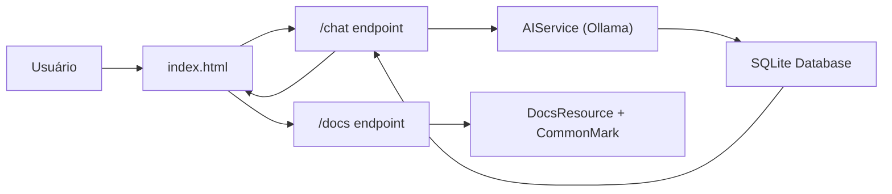

# Documentação da Aplicação **Quarkus AI Database Assistant**

> 💡 Um assistente de banco de dados com IA integrado ao SQLite, construído em **Java + Quarkus + Ollama**.  
> Permite criar, consultar e gerenciar bancos de dados usando **linguagem natural**.

---

<a id="sumario"></a>
## 📚 Sumário

1. [Visão Geral](#visao-geral)  
2. [Estrutura do Projeto](#estrutura-do-projeto)  
3. [Pré-requisitos e Configuração](#pre-requisitos-e-configuracao)  
4. [Componentes Principais](#componentes-principais)  
   - [Backend (Java/Quarkus)](#backend-java-quarkus)  
   - [Frontend (HTML/CSS/JavaScript)](#frontend-html-css-javascript)  
5. [Como a Aplicação Funciona (Fluxo de Uso)](#como-a-aplicacao-funciona-fluxo-de-uso)  
6. [Guia Rápido de Uso](#guia-rapido-de-uso)  
7. [Manutenção e Expansão](#manutencao-e-expansao)  
8. [Problemas Comuns (Troubleshooting)](#problemas-comuns-troubleshooting)  
9. [Fluxo Geral da Aplicação](#fluxo-geral-da-aplicacao)  
10. [Licença e Contribuição](#licenca-e-contribuicao)

---

<a id="visao-geral"></a>
## 🧠 Visão Geral

Esta aplicação é um **assistente de banco de dados com inteligência artificial**, projetado para ajudar usuários — mesmo iniciantes — a interagir com bancos de dados **SQLite** usando linguagem natural.

Você pode digitar frases como:

> “Crie um banco de dados de clientes com uma tabela `pessoas` (id, nome, idade)”  
> ou  
> “Liste todos os produtos cadastrados”.

A IA (chamada **Tenebra**) traduz suas solicitações em comandos SQL, executa-os e mostra os resultados, tudo em uma interface de chat amigável.

A arquitetura combina:
- ⚙️ **Quarkus** – backend leve e performático.  
- 🧩 **LangChain4j + Ollama** – integração com modelo de linguagem (LLM).  
- 💻 **HTML + CSS + JS** – frontend simples e intuitivo.  
- 🪶 **CommonMark** – renderiza a documentação Markdown da aplicação (novo).

---

<a id="estrutura-do-projeto"></a>
## 🗂️ Estrutura do Projeto

```
.
├── pom.xml                   # Configuração do Maven e dependências.
├── DOCUMENTACAO.MD           # Arquivo principal de documentação em Markdown.
├── src
│   └── main
│       ├── java
│       │   └── br
│       │       └── fatec
│       │           ├── AIService.java          # Interface da IA.
│       │           ├── BrowserLauncher.java    # Abre o navegador na inicialização.
│       │           ├── ChatResource.java       # Endpoint principal do chat.
│       │           ├── DatabaseResource.java   # Endpoint para consultas SQL diretas.
│       │           ├── DocsResource.java       # Servidor de documentação Markdown (/docs).
│       │           └── TestResource.java       # Endpoint de teste.
│       └── resources
│           ├── application.properties          # Configurações da aplicação.
│           └── META-INF
│               └── resources
│                   ├── index.html              # Interface de chat (frontend).
│                   └── DOCUMENTACAO.MD         # Cópia servida pelo DocsResource (recomendado).
```

---

<a id="pre-requisitos-e-configuracao"></a>
## ⚙️ Pré-requisitos e Configuração

Antes de rodar o projeto, instale os seguintes componentes:

### 🔧 Requisitos

- **Java 21+**
- **Maven 3.9+**
- **Ollama** instalado e rodando localmente (veja https://ollama.com)
- Conexão de internet (apenas para baixar dependências e fontes externas, se necessário)

### 🧩 Baixe o modelo de IA

```bash
ollama pull qwen3:8b
```

### ▶️ Como executar o projeto (passo a passo)

1. Clone o repositório:
   ```bash
   git clone https://github.com/usuario/quarkus-bot-db.git
   cd quarkus-bot-db
   ```

2. Copie a documentação para os recursos estáticos (recomendado para produção):
   ```bash
   mkdir -p src/main/resources/META-INF/resources
   cp DOCUMENTACAO.MD src/main/resources/META-INF/resources/
   ```

3. Compile o projeto:
   ```bash
   mvn clean package
   ```

4. Execute o Ollama (em outro terminal):
   ```bash
   ollama run qwen3:8b
   ```

5. Inicie a aplicação Quarkus:
   ```bash
   java -jar target/quarkus-bot-db-1.0.0-SNAPSHOT-runner.jar
   ```

6. O navegador será aberto automaticamente em:  
   👉 http://localhost:8080

---

<a id="componentes-principais"></a>
## 🧩 Componentes Principais

<a id="backend-java-quarkus"></a>
### 1. Backend (Java/Quarkus)

#### 🧱 `pom.xml`

Gerencia dependências e build. Além das dependências base já existentes, foi adicionada a dependência **CommonMark** para renderizar Markdown em HTML:

```xml
<dependency>
    <groupId>org.commonmark</groupId>
    <artifactId>commonmark</artifactId>
    <version>0.22.0</version>
</dependency>
```

**Importante:** Após editar o `pom.xml`, execute `mvn clean package` para baixar as dependências.

---

#### ⚙️ `application.properties`

Principais parâmetros (exemplo):

```properties
quarkus.langchain4j.ollama.chat-model.model-id=qwen3:8b
quarkus.langchain4j.ollama.timeout=120s
quarkus.http.static-resources.enable=true
quarkus.http.static-resources.paths=/
```

- `model-id` → Define o modelo da IA.  
- `timeout` → Tempo máximo de resposta da IA.  
- `static-resources` → Habilita o frontend (`index.html`) e o acesso a arquivos estáticos.

---

#### 🧠 `AIService.java`

Interface que define a comunicação com a IA. Exemplo de responsabilidades:
- Definir o prompt do sistema com `@SystemMessage` (personalidade, regras e segurança).  
- Enviar a conversa/contexto ao modelo via LangChain4j.  
- Receber a resposta textual do modelo.

**Assinatura típica:**
```java
String input(String input);
```

---

#### 💬 `ChatResource.java` (Endpoint `/chat`)

Ponto central da aplicação. Funcionalidades resumidas:
- Recebe POST com mensagem do usuário e `sessionId`.  
- Mantém histórico por `sessionId`.  
- Detecta nome de banco (`detectaNomeBanco`) por regex.  
- Envia prompt/contexto para `AIService`.  
- Extrai blocos SQL da resposta (`extrairBlocosSQL`).  
- Executa SQL no banco usando JDBC (`executarComandosSQL`).  
- Retorna resposta formatada ao frontend.

**Métodos auxiliares (descrição):**

- `detectaNomeBanco(String msg)`: identifica expressões do tipo "crie o banco X" ou "no banco X".  
- `extrairBlocosSQL(String texto)`: encontra trechos entre ```sql ... ``` e retorna lista de comandos.  
- `executarComandosSQL(String db, List<String> comandos)`: abre conexão JDBC com `db`.db e executa statements; retorna logs e resultados.  
- `formatarResposta(...)`: compõe o HTML/texto final combinado com o texto da IA e o resultado das consultas.

---

#### 🗃️ `DatabaseResource.java` (Endpoint `/db/query`)

Fornece execução direta de consultas SQL com proteção. Aceita apenas `SELECT` por segurança.

Exemplo de uso (HTTP POST JSON):
```json
{ "dbName": "escola", "sql": "SELECT * FROM alunos;" }
```

Resposta: JSON com colunas e linhas ou mensagem de erro.

---

#### 🧾 `DocsResource.java` (Novo endpoint `/docs`)

Classe criada para servir a documentação Markdown renderizada como HTML. Local: `br.fatec.DocsResource`.

Exemplo de implementação (resumido):

```java
package br.fatec;

import jakarta.ws.rs.GET;
import jakarta.ws.rs.Path;
import jakarta.ws.rs.Produces;
import jakarta.ws.rs.core.MediaType;

import java.io.IOException;
import java.nio.file.Files;
import org.commonmark.node.*;
import org.commonmark.parser.Parser;
import org.commonmark.renderer.html.HtmlRenderer;

@Path("/docs")
public class DocsResource {

    @GET
    @Produces(MediaType.TEXT_HTML)
    public String showDocumentation() throws IOException {
        java.nio.file.Path docPath = java.nio.file.Path.of("DOCUMENTACAO.MD");
        String markdown = Files.readString(docPath);

        Parser parser = Parser.builder().build();
        Node document = parser.parse(markdown);
        HtmlRenderer renderer = HtmlRenderer.builder().build();
        String htmlContent = renderer.render(document);

        return "<!DOCTYPE html>... (HTML wrapper com github-markdown.css) " + htmlContent;
    }
}
```

**Observações e boas práticas:**
- Durante desenvolvimento, `Path.of("DOCUMENTACAO.MD")` lê o arquivo na raiz do projeto.  
- Para empacotar em jar/uber-jar, prefira colocar `DOCUMENTACAO.MD` em `src/main/resources/META-INF/resources` e ler via `getResourceAsStream` ou servir diretamente como recurso estático.
- Assegure que o arquivo esteja codificado em UTF-8.

---

#### 🌐 `BrowserLauncher.java`

Classe utilitária que abre automaticamente o navegador no `StartupEvent` para `http://localhost:8080` quando em modo desenvolvimento/execução.

---

#### 🔍 `TestResource.java`

Endpoint simples `/test` para verificar disponibilidade do serviço. Exemplo:

```
GET /test  -> "Olá! Este é um endpoint de teste."
```

---

<a id="frontend-html-css-javascript"></a>
### 2. Frontend (HTML/CSS/JavaScript)

#### 📄 `index.html`

Página única que implementa a interface do chat. Destaques:
- Layout responsivo e limpo (CSS + Font Awesome).  
- `localStorage` para guardar `sessionId`.  
- `fetch` para `/chat`, `/chat/welcome`, `/chat/model`.  
- Atalhos (Ctrl+Enter) e botões de prompts prontos.  
- Exibição de mensagens (usuário vs IA) com estilos separados.

**Rodapé atualizado (link para docs):**

```html
<footer class="footer">
    Powered by AI ✨
    <span id="model-info" style="color:#888;font-size:0.95em;"></span>
    <br>
    <a href="/docs" target="_blank" style="color:#0077cc;text-decoration:none;font-weight:500;">
        📘 Ver Documentação
    </a>
</footer>
```

---

<a id="como-a-aplicacao-funciona-fluxo-de-uso"></a>
## 🔁 Como a Aplicação Funciona (Fluxo de Uso)

1. O usuário inicia a aplicação; `BrowserLauncher` abre o navegador.  
2. O frontend solicita a mensagem de boas-vindas ao backend (`/chat/welcome`).  
3. O usuário envia comandos via `/chat`.  
4. O backend processa, consulta a IA (Ollama), executa SQL no SQLite e retorna o resultado.  
5. O usuário vê a resposta no chat.  
6. Para visualizar a documentação, clica em “📘 Ver Documentação”, que abre `/docs` em nova aba.

---

<a id="guia-rapido-de-uso"></a>
## ⚡ Guia Rápido de Uso

| Ação | Exemplo de comando | Resultado esperado |
|------|--------------------|--------------------|
| Criar banco e tabela | `Crie o banco vendas com tabela produtos (id, nome, preco)` | Banco e tabela criados |
| Inserir dados | `Adicione produtos: (1, Caneta, 2.50)` | Dados inseridos |
| Consultar | `Liste todos os produtos` | Tabela de resultados |
| Otimizar query | `Otimizar essa query SQL: SELECT * FROM vendas WHERE preco > 10;` | Query reescrita pela IA |
| Abrir documentação | Clique em “📘 Ver Documentação” | Exibe documentação formatada |

---

<a id="manutencao-e-expansao"></a>
## 🧩 Manutenção e Expansão

- Trocar modelo da IA: alterar `quarkus.langchain4j.ollama.chat-model.model-id` em `application.properties`.  
- Aumentar timeout: `quarkus.langchain4j.ollama.timeout=180s` se necessário.  
- Suportar outro SGBD: substituir driver JDBC no `pom.xml` e adaptar conexões/URL.  
- Personalizar prompt do sistema: editar `@SystemMessage` em `AIService.java`.

---

<a id="problemas-comuns-troubleshooting"></a>
## 🧰 Problemas Comuns (Troubleshooting)

| Problema | Causa provável | Solução |
|-----------|----------------|----------|
| **/docs exibe erro "não encontrado"** | `DOCUMENTACAO.MD` não está na pasta correta | Copie para `src/main/resources/META-INF/resources/` ou ajuste caminho em `DocsResource` |
| **No candidates found for Path.of(...)** | Import conflitado (`jakarta.ws.rs.Path` vs `java.nio.file.Path`) | Use `java.nio.file.Path.of(...)` completamente qualificado ou importe corretamente |
| **"Erro ao conectar com a IA"** | Ollama não está rodando | Execute `ollama run qwen3:8b` |
| **"Database locked"** | Arquivo `.db` aberto em outro processo | Feche o arquivo ou reinicie a aplicação |
| **"Timeout da IA"** | Modelo demorando para responder | Aumente timeout em `application.properties` |
| **"Permissão negada"** | Sem acesso de gravação no diretório | Execute com permissões adequadas ou mude local de DB |

---

<a id="fluxo-geral-da-aplicacao"></a>
## 🧭 Fluxo Geral da Aplicação



---

<a id="licenca-e-contribuicao"></a>
## 🪪 Licença e Contribuição

Este projeto é distribuído sob a licença **MIT**.  
Sinta-se livre para usar, modificar e contribuir! 🚀

Para contribuir:
1. Faça um *fork* do repositório.  
2. Crie uma *branch* (`feature/nome-da-feature`).  
3. Envie um *pull request* com suas melhorias.
