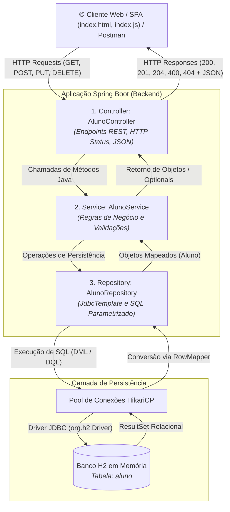
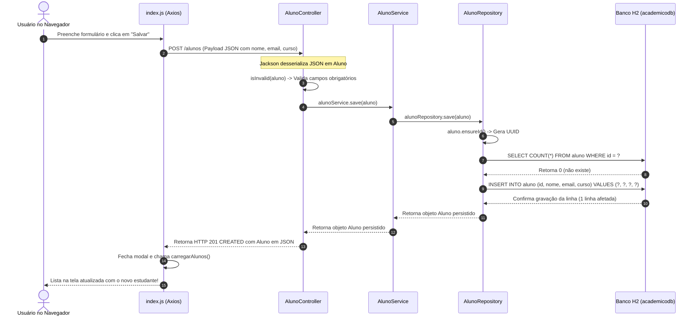

# 📖 Guia Definitivo de Arquitetura e Código: Spring Boot com JDBC do Zero ao Banco de Dados

Este documento é o guia didático completo do projeto **Sistema Acadêmico** (Trabalho 1 da disciplina de Laboratório de Desenvolvimento em Banco de Dados III - Prof. Bertoti). Ele foi projetado para estudantes de **Java**, **Orientação a Objetos (POO)**, **Spring Boot**, **Spring JDBC** e **Banco de Dados Relacional (H2 / SQL)**, explicando exaustivamente cada classe, método, conceito teórico, comando SQL, construtor, herança, polimorfismo e encapsulamento.

---

## 📑 Sumário Completo

1. [Visão Geral e Objetivos de Aprendizagem](#1-visão-geral-e-objetivos-de-aprendizagem)
   - [1.1. Como Executar e Abrir no Navegador (Passo a Passo Rápido)](#11-como-executar-e-abrir-no-navegador-passo-a-passo-rápido)
2. [Fundamentos de Banco de Dados: Por que usar JDBC no início?](#2-fundamentos-de-banco-de-dados-por-que-usar-jdbc-no-início)
   - [2.1. Diferenças entre DDL, DML e DQL](#21-diferenças-entre-ddl-dml-e-dql)
   - [2.2. A Anatomia da Conexão JDBC e o Papel do JdbcTemplate](#22-a-anatomia-da-conexão-jdbc-e-o-papel-do-jdbctemplate)
   - [2.3. Comparativo Prático: JDBC Puro Clássico vs Spring JdbcTemplate](#23-comparativo-prático-jdbc-puro-clássico-vs-spring-jdbctemplate)
3. [Pilares de Orientação a Objetos (POO) Aplicados no Projeto](#3-pilares-de-orientação-a-objetos-poo-aplicados-no-projeto)
   - [3.1. Abstração e Modelagem de Entidade](#31-abstração-e-modelagem-de-entidade)
   - [3.2. Encapsulamento e Modificadores de Acesso](#32-encapsulamento-e-modificadores-de-acesso)
   - [3.3. Herança e Sobrescrita (@Override)](#33-herança-e-sobrescrita-override)
   - [3.4. Polimorfismo e Interfaces Funcionais (RowMapper / Lambdas)](#34-polimorfismo-e-interfaces-funcionais-rowmapper--lambdas)
   - [3.5. Sobrecarga de Construtores (Overloading)](#35-sobrecarga-de-construtores-overloading)
4. [Arquitetura em Camadas (Layered Architecture) e Fluxo de Dados](#4-arquitetura-em-camadas-layered-architecture-e-fluxo-de-dados)
   - [4.1. Diagrama Visual da Arquitetura](#41-diagrama-visual-da-arquitetura)
   - [4.2. Diagrama de Sequência de uma Requisição Web](#42-diagrama-de-sequência-de-uma-requisição-web)
   - [4.3. Ciclo de Vida Passo a Passo de uma Requisição Web](#43-ciclo-de-vida-passo-a-passo-de-uma-requisição-web)
5. [Análise Detalhada de Todos os Arquivos do Backend](#5-análise-detalhada-de-todos-os-arquivos-do-backend)
   - [5.1. schema.sql (Script DDL de Criação da Tabela)](#51-schemasql-script-ddl-de-criação-da-tabela)
   - [5.2. Aluno.java (Modelo de Domínio / POJO)](#52-alunojava-modelo-de-domínio--pojo)
   - [5.3. AlunoRepository.java (Acesso a Dados com JdbcTemplate e SQL)](#53-alunorepositoryjava-acesso-a-dados-com-jdbctemplate-e-sql)
   - [5.4. AlunoService.java (Camada de Regras de Negócio)](#54-alunoservicejava-camada-de-regras-de-negócio)
   - [5.5. AlunoController.java (Controlador REST e Endpoints HTTP)](#55-alunocontrollerjava-controlador-rest-e-endpoints-http)
   - [5.6. SburRestDemoApplication.java (Ponto de Entrada e Carga Inicial)](#56-sburrestdemoapplicationjava-ponto-de-entrada-e-carga-inicial)
   - [5.7. application.properties (Configuração do DataSource e H2)](#57-applicationproperties-configuração-do-datasource-e-h2)
   - [5.8. pom.xml (Gerenciamento de Dependências Maven)](#58-pomxml-gerenciamento-de-dependências-maven)
6. [Análise dos Testes Automatizados](#6-análise-dos-testes-automatizados)
   - [6.1. AlunoControllerTest.java (Testes de Integração com MockMvc)](#61-alunocontrollertestjava-testes-de-integração-com-mockmvc)
   - [6.2. SburRestDemoApplicationTests.java (Teste de Carga do Contexto)](#62-sburrestdemoapplicationtestsjava-teste-de-carga-do-contexto)
7. [Análise da Camada Frontend (Interface Web SPA)](#7-análise-da-camada-frontend-interface-web-spa)
   - [7.1. index.html (Estrutura e Elementos Visuais)](#71-indexhtml-estrutura-e-elementos-visuais)
   - [7.2. index.js (Consumo Completo da API com Axios Comentado)](#72-indexjs-consumo-completo-da-api-com-axios-comentado)
   - [7.3. style.css (Estilização Customizada)](#73-stylecss-estilização-customizada)
8. [Tabela Resumo das Anotações e Tecnologias](#8-tabela-resumo-das-anotações-e-tecnologias)
9. [Guia de Resolução de Problemas Comuns (Troubleshooting para Estudantes)](#9-guia-de-resolução-de-problemas-comuns-troubleshooting-para-estudantes)
10. [Guia de Estudo e Exercícios Práticos para Iniciantes](#10-guia-de-estudo-e-exercícios-práticos-para-iniciantes)

---

## 1. Visão Geral e Objetivos de Aprendizagem

Este projeto foi construído para servir como o modelo pedagógico de referência da disciplina **Laboratório de Desenvolvimento em Banco de Dados III**, ensinando o funcionamento real do ecossistema backend em Java com Spring Boot e banco relacional.

### O que aprenderemos na prática:
1. **Comandos SQL Reais:** Como estruturar comandos de banco de dados (`CREATE TABLE`, `INSERT`, `SELECT`, `UPDATE`, `DELETE`) de forma parametrizada e imune a ataques de SQL Injection.
2. **Conexão Java + Banco de Dados:** Como o Spring Boot gerencia conexões através do pool **HikariCP** e como o `JdbcTemplate` abstrai a complexidade do driver JDBC.
3. **Mapeamento Objeto-Relacional Manual:** Como transformar linhas do banco (`ResultSet`) em objetos Java em memória através da interface funcional `RowMapper`.
4. **Arquitetura em Camadas (Layered Architecture):** O porquê e como separar **Controller** (Web/HTTP), **Service** (Regras de Negócio) e **Repository** (Persistência).
5. **Boas Práticas de API RESTful:** Utilização semântica dos verbos HTTP (`GET`, `POST`, `PUT`, `DELETE`) e dos códigos de resposta HTTP (`200 OK`, `201 CREATED`, `204 NO CONTENT`, `400 BAD REQUEST`, `404 NOT FOUND`).
6. **Frontend Integrado:** Como uma aplicação cliente no navegador interage em tempo real com o backend através de requisições assíncronas JSON.

---

### 1.1. Como Executar e Abrir no Navegador (Passo a Passo Rápido)

1. **Abra o Terminal e entre na pasta do projeto:**
   ```bash
   cd Lab3/Trabalho-1
   ```
2. **Inicie o servidor com o wrapper do Maven:**
   * No **Windows (PowerShell / CMD):** `.\mvnw.cmd clean spring-boot:run`
   * No **Linux / macOS:** `./mvnw clean spring-boot:run`
3. **Aguarde a mensagem no terminal:** `Started SburRestDemoApplication in X seconds`.
4. **Abra o Navegador e explore as interfaces disponíveis:**
   * 👉 **Interface Gráfica (Frontend SPA):** [http://localhost:8080/](http://localhost:8080/)
   * 🗃️ **Console do Banco H2:** [http://localhost:8080/h2-console](http://localhost:8080/h2-console)  
     *(Atenção: no campo `JDBC URL`, use exatamente `jdbc:h2:mem:academicodb`, Usuário: `sa`, Senha: em branco)*
   * 🔌 **Endpoint REST da API (Retorno JSON):** [http://localhost:8080/alunos](http://localhost:8080/alunos)

---

## 2. Fundamentos de Banco de Dados: Por que usar JDBC no início?

### 2.1. Diferenças entre DDL, DML e DQL

Para quem estuda banco de dados relacional, a linguagem SQL divide-se em categorias essenciais:

* **DDL (Data Definition Language - Linguagem de Definição de Dados):**
  * Comandos responsáveis por definir ou modificar o catálogo e a estrutura das tabelas.
  * **Exemplo no projeto:** `CREATE TABLE IF NOT EXISTS aluno (...)` em `schema.sql`.
* **DML (Data Manipulation Language - Linguagem de Manipulação de Dados):**
  * Comandos responsáveis por gravar, modificar ou excluir registros (linhas) de dados.
  * **Exemplos no projeto:**
    * `INSERT INTO aluno (id, nome, email, curso) VALUES (?, ?, ?, ?)`
    * `UPDATE aluno SET nome = ?, email = ?, curso = ? WHERE id = ?`
    * `DELETE FROM aluno WHERE id = ?`
* **DQL (Data Query Language - Linguagem de Consulta de Dados):**
  * Comandos responsáveis por consultar e recuperar informações armazenadas.
  * **Exemplos no projeto:**
    * `SELECT id, nome, email, curso FROM aluno`
    * `SELECT id, nome, email, curso FROM aluno WHERE id = ?`
    * `SELECT COUNT(*) FROM aluno`

---

### 2.2. A Anatomia da Conexão JDBC e o Papel do `JdbcTemplate`

No Java tradicional (JDBC puro antigo), para executar uma simples consulta era necessário escrever dezenas de linhas repetitivas (*boilerplate*) para abrir `Connection`, `PreparedStatement`, percorrer o `ResultSet` e gerenciar blocos `try-catch-finally` fechando cada recurso manualmente.

O **`JdbcTemplate` do Spring Boot** elimina todo esse código repetitivo, cuidando automaticamente de:
1. Obter e devolver conexões do pool gerenciado pelo **HikariCP**;
2. Criar e parametrizar o `PreparedStatement` com proteção nativa contra **SQL Injection**;
3. Iterar sobre o `ResultSet` e delegar o mapeamento para o `RowMapper`;
4. Fechar todos os recursos com segurança, mesmo se ocorrer uma exceção;
5. Traduzir exceções de banco checadas (`SQLException`) em exceções consistentes de tempo de execução (`DataAccessException`).

---

### 2.3. Comparativo Prático: JDBC Puro Clássico vs Spring JdbcTemplate

Veja a diferença que explica por que o Spring Boot revolucionou o desenvolvimento Java:

```java
// ========================================================================
// ❌ ABORDAGEM ANTIGA: JDBC PURO (Complexa, repetitiva e propensa a vazamento de memória)
// ========================================================================
public Aluno findByIdAntigo(String id) {
    Connection conn = null;
    PreparedStatement ps = null;
    ResultSet rs = null;
    try {
        conn = dataSource.getConnection(); // Abre conexão manual
        ps = conn.prepareStatement("SELECT id, nome, email, curso FROM aluno WHERE id = ?");
        ps.setString(1, id); // Parâmetro manual baseado em índice 1-based
        rs = ps.executeQuery();
        if (rs.next()) {
            return new Aluno(rs.getString("id"), rs.getString("nome"), rs.getString("email"), rs.getString("curso"));
        }
        return null;
    } catch (SQLException e) {
        throw new RuntimeException("Erro ao consultar banco", e);
    } finally {
        // Fechamento manual obrigatório para evitar memory leaks
        try { if (rs != null) rs.close(); } catch (SQLException ignored) {}
        try { if (ps != null) ps.close(); } catch (SQLException ignored) {}
        try { if (conn != null) conn.close(); } catch (SQLException ignored) {}
    }
}

// ========================================================================
// ✅ ABORDAGEM MODERNA: SPRING JDBCTEMPLATE (Limpa, segura e concisa)
// ========================================================================
public Optional<Aluno> findByIdModerno(String id) {
    String sql = "SELECT id, nome, email, curso FROM aluno WHERE id = ?";
    List<Aluno> results = jdbcTemplate.query(sql, alunoRowMapper, id);
    return results.stream().findFirst();
}
```

---

## 3. Pilares de Orientação a Objetos (POO) Aplicados no Projeto

---

### 3.1. Abstração e Modelagem de Entidade
A classe `Aluno` abstrai um estudante do mundo real, isolando somente as características essenciais para o sistema acadêmico: identificador único (`id`), nome (`nome`), correio eletrônico (`email`) e curso (`curso`).

---

### 3.2. Encapsulamento e Modificadores de Acesso
* **Atributos Privados (`private`):** O estado interno do objeto é protegido contra mutações arbitrárias e descontroladas.
* **Métodos Públicos (`public` - Getters e Setters):** Fornecem uma interface pública controlada e segura para ler e atualizar as propriedades do aluno.

---

### 3.3. Herança e Sobrescrita (`@Override`)

Em Java, toda classe herda implicitamente da classe raiz **`java.lang.Object`**.

No arquivo `Aluno.java`, sobrescrevemos (`@Override`) três métodos essenciais:
1. **`equals(Object o)`:** Define que a identidade de dois alunos depende exclusivamente do seu `id` (chave de negócio).
2. **`hashCode()`:** Gera um código hash numérico derivado do `id`, mantendo consistência estrita com o `equals` para que o aluno funcione corretamente em tabelas hash (`HashSet`, `HashMap`).
3. **`toString()`:** Converte o estado do objeto em texto legível para logs e diagnóstico.

---

### 3.4. Polimorfismo e Interfaces Funcionais (RowMapper / Lambdas)

O **Polimorfismo** aparece de duas formas principais:

1. **`RowMapper<T>`:** É uma interface do Spring com o método abstrato `T mapRow(ResultSet rs, int rowNum)`. No `AlunoRepository`, fornecemos uma implementação concreta através de uma **expressão Lambda**:
   ```java
   // O Spring trata a expressão Lambda como uma instância polimórfica de RowMapper<Aluno>
   private final RowMapper<Aluno> alunoRowMapper = (rs, rowNum) -> new Aluno(
           rs.getString("id"),
           rs.getString("nome"),
           rs.getString("email"),
           rs.getString("curso")
   );
   ```
2. **Polimorfismo de Coleções:** Os métodos do `Service` e `Controller` retornam `Iterable<Aluno>` ou `List<Aluno>`, permitindo que o consumidor manipule a coleção sem se acoplar a uma implementação concreta específica (como `ArrayList` ou `LinkedList`).

---

### 3.5. Sobrecarga de Construtores (Overloading)

A classe `Aluno` possui **três construtores sobrecarregados** (mesmo nome, assinaturas diferentes):

1. **`public Aluno()`:** Construtor sem argumentos exigido por frameworks de desserialização (como o Jackson ao converter JSON para Java).
2. **`public Aluno(String id, String nome, String email, String curso)`:** Construtor completo com todos os argumentos, usado pelo `RowMapper` e testes.
3. **`public Aluno(String nome, String email, String curso)`:** Construtor conveniente para novos cadastros que utiliza **`this(...)`** para reaproveitar o construtor completo, gerando um UUID automaticamente:
   ```java
   public Aluno(String nome, String email, String curso) {
       this(UUID.randomUUID().toString(), nome, email, curso);
   }
   ```

---

## 4. Arquitetura em Camadas (Layered Architecture) e Fluxo de Dados

---

### 4.1. Diagrama Visual da Arquitetura



---

### 4.2. Diagrama de Sequência de uma Requisição Web

Veja o ciclo de vida completo no cadastro de um novo aluno:



---

### 4.3. Ciclo de Vida Passo a Passo de uma Requisição Web

1. **Disparo no Frontend:** O arquivo `index.js` intercepta o evento de `submit` do formulário, valida os campos e envia a requisição assíncrona com `axios.post('/alunos', payload)`.
2. **Recepção no Controller:** O Spring MVC roteia a chamada para o método anotado com `@PostMapping`. A biblioteca Jackson faz o *parsing* do corpo JSON para a classe Java `Aluno`.
3. **Validação e Repasse:** O controller verifica se os campos obrigatórios estão preenchidos; se estiverem válidos, delega o processamento ao `alunoService.save(aluno)`.
4. **Execução no Repository (DAO):** O service encaminha a operação para `alunoRepository.save(aluno)`.
   - É chamado `aluno.ensureId()`, garantindo que o registro possua um UUID único;
   - O repositório faz a checagem via `existsById(...)`: se o ID já existisse, realizaria `UPDATE`; como não existe, monta o comando `INSERT INTO aluno (...) VALUES (?, ?, ?, ?)`;
   - O `JdbcTemplate` obtém uma conexão do HikariCP e envia o SQL parametrizado ao driver H2.
5. **Gravação no H2:** O motor relacional do banco grava os dados na tabela em memória `aluno`.
6. **Resposta ao Cliente:** O objeto salvo é empacotado em um `ResponseEntity<>(saved, HttpStatus.CREATED)` com código **201**, retornando pela rede ao cliente e disparando a renderização visual na página web.

---

## 5. Análise Detalhada de Todos os Arquivos do Backend

---

### 5.1. `schema.sql` (Script DDL de Criação da Tabela)

Arquivo: `src/main/resources/schema.sql`

```sql
-- ========================================================================
-- Script DDL (Data Definition Language) de Inicialização do Banco Relacional
-- Executado automaticamente pelo Spring Boot na inicialização da aplicação
-- ========================================================================

-- Cria a tabela 'aluno' se ela ainda não existir no catálogo do banco H2
CREATE TABLE IF NOT EXISTS aluno (
    -- Chave primária (Primary Key) textual única para cada aluno (gerada via UUID)
    id VARCHAR(255) PRIMARY KEY,
    
    -- Nome completo do aluno (obrigatório, restrição NOT NULL)
    nome VARCHAR(255) NOT NULL,
    
    -- Endereço de e-mail institucional ou de contato (obrigatório, restrição NOT NULL)
    email VARCHAR(255) NOT NULL,
    
    -- Nome do curso de graduação matriculado (obrigatório, restrição NOT NULL)
    curso VARCHAR(255) NOT NULL
);
```

* **`CREATE TABLE IF NOT EXISTS aluno`:** Instrução DDL que cria a tabela `aluno` apenas se ela ainda não existir no banco.
* **`id VARCHAR(255) PRIMARY KEY`:** Define a coluna `id` como texto de até 255 caracteres e estabelece que ela é a **Chave Primária (Primary Key)**, garantindo unicidade e indexação rápida.
* **`nome`, `email`, `curso` com `NOT NULL`:** Colunas de dados obrigatórias. A restrição `NOT NULL` impede que linhas sejam salvas sem essas informações.

---

### 5.2. `Aluno.java` (Modelo de Domínio / POJO)

Arquivo: `src/main/java/com/thehecklers/sburrestdemo/model/Aluno.java`

```java
package com.thehecklers.sburrestdemo.model;

import java.util.Objects;
import java.util.UUID;

// Classe de Domínio (POJO / Entidade) representando um Aluno no sistema
@SuppressWarnings("unused")
public class Aluno {

    // ====================================================================
    // Atributos Privados (Princípio de Encapsulamento de POO)
    // O estado do objeto não pode ser acessado diretamente de fora da classe
    // ====================================================================
    private String id;       // Identificador único universal (UUID)
    private String nome;     // Nome completo do estudante
    private String email;    // Endereço de e-mail do estudante
    private String curso;    // Nome do curso em que o estudante está matriculado

    // ====================================================================
    // Construtores Sobrecarregados (Princípio de Sobrecarga / Overloading)
    // ====================================================================

    // Construtor 1: Padrão sem argumentos (Default Constructor)
    // Essencial para frameworks como Jackson converterem JSON -> Objeto Java via reflexão
    public Aluno() {
    }

    // Construtor 2: Completo com todos os campos
    // Utilizado pelo RowMapper ao ler dados do banco relacional ou em testes unitários
    public Aluno(String id, String nome, String email, String curso) {
        this.id = id;
        this.nome = nome;
        this.email = email;
        this.curso = curso;
    }

    // Construtor 3: Sem ID prévio (utilizado no cadastro de novos alunos)
    // Encadeia a chamada ao Construtor 2 através de this(...), gerando um UUID aleatório
    public Aluno(String nome, String email, String curso) {
        this(UUID.randomUUID().toString(), nome, email, curso);
    }

    // ====================================================================
    // Método Auxiliar de Segurança Defensiva
    // ====================================================================

    // Garante que o objeto tenha um identificador válido antes de ser persistido no banco
    public void ensureId() {
        if (this.id == null || this.id.isBlank()) {
            this.id = UUID.randomUUID().toString();
        }
    }

    // ====================================================================
    // Métodos Getters e Setters (Encapsulamento)
    // Permitem leitura e alteração controlada dos atributos privados
    // ====================================================================

    // Obtém o identificador do aluno
    public String getId() { return id; }
    // Define ou altera o identificador do aluno
    public void setId(String id) { this.id = id; }

    // Obtém o nome do aluno
    public String getNome() { return nome; }
    // Define ou altera o nome do aluno
    public void setNome(String nome) { this.nome = nome; }

    // Obtém o e-mail do aluno
    public String getEmail() { return email; }
    // Define ou altera o e-mail do aluno
    public void setEmail(String email) { this.email = email; }

    // Obtém o curso do aluno
    public String getCurso() { return curso; }
    // Define ou altera o curso do aluno
    public void setCurso(String curso) { this.curso = curso; }

    // ====================================================================
    // Sobrescrita de Métodos de java.lang.Object (@Override)
    // ====================================================================

    // Define a igualdade lógica: dois objetos Aluno são iguais se possuírem o mesmo 'id'
    @Override
    public boolean equals(Object o) {
        if (this == o) return true; // Mesma referência em memória
        if (!(o instanceof Aluno aluno)) return false; // Tipos incompatíveis ou nulo
        return Objects.equals(id, aluno.id); // Comparação segura por id
    }

    // Gera o código hash baseado no 'id', garantindo coerência com o método equals
    @Override
    public int hashCode() {
        return Objects.hash(id);
    }

    // Retorna a representação textual do objeto para logs, console e depuração
    @Override
    public String toString() {
        return "Aluno{" + "id='" + id + '\'' + ", nome='" + nome + '\'' + ", email='" + email + '\'' + ", curso='" + curso + '\'' + '}';
    }
}
```

* **Atributos privados:** Compõem o estado do objeto (Encapsulamento).
* **Construtor padrão sem argumentos:** Necessário para serializadores JSON como Jackson.
* **Construtor completo:** Inicializa todos os campos.
* **Construtor com sobrecarga (`this(...)`):** Gera automaticamente um identificador UUID.
* **`ensureId`:** Método de segurança defensiva: se o aluno foi instanciado sem ID, gera um UUID antes de enviar a query de inserção.
* **Getters e Setters:** Métodos para leitura e alteração controlada.
* **`equals` e `hashCode`:** Sobrescrita dos métodos de `Object` para comparação baseada no `id`.
* **`toString`:** Formata os dados do objeto em String para fácil visualização.

---

### 5.3. `AlunoRepository.java` (Acesso a Dados com JdbcTemplate e SQL)

Arquivo: `src/main/java/com/thehecklers/sburrestdemo/repository/AlunoRepository.java`

```java
package com.thehecklers.sburrestdemo.repository;

import com.thehecklers.sburrestdemo.model.Aluno;
import org.springframework.jdbc.core.JdbcTemplate;
import org.springframework.jdbc.core.RowMapper;
import org.springframework.stereotype.Repository;

import java.util.List;
import java.util.Optional;

// @Repository indica que esta classe é um componente de persistência (DAO) gerenciado pelo Spring
@SuppressWarnings({"SqlResolve", "SqlWithoutWhere", "unused"})
@Repository
public class AlunoRepository {

    // Componente central do Spring JDBC para execução de comandos SQL com segurança e pooling
    private final JdbcTemplate jdbcTemplate;

    // RowMapper funcional implementado com Lambda: converte cada linha do ResultSet relacional em um objeto Aluno
    private final RowMapper<Aluno> alunoRowMapper = (rs, rowNum) -> new Aluno(
            rs.getString("id"),     // Extrai o valor da coluna 'id'
            rs.getString("nome"),   // Extrai o valor da coluna 'nome'
            rs.getString("email"),  // Extrai o valor da coluna 'email'
            rs.getString("curso")   // Extrai o valor da coluna 'curso'
    );

    // Injeção de Dependência por construtor: o Spring fornece a instância configurada do JdbcTemplate
    public AlunoRepository(JdbcTemplate jdbcTemplate) {
        this.jdbcTemplate = jdbcTemplate;
    }

    // Consulta e retorna todos os registros da tabela 'aluno' mapeados em List<Aluno>
    public List<Aluno> findAll() {
        String sql = "SELECT id, nome, email, curso FROM aluno";
        return jdbcTemplate.query(sql, alunoRowMapper);
    }

    // Busca um aluno pelo seu ID único de forma parametrizada (evita SQL Injection)
    // Retorna Optional<Aluno> para indicar explicitamente a presença ou ausência do registro
    public Optional<Aluno> findById(String id) {
        String sql = "SELECT id, nome, email, curso FROM aluno WHERE id = ?";
        List<Aluno> results = jdbcTemplate.query(sql, alunoRowMapper, id);
        return results.stream().findFirst();
    }

    // Operação de Upsert (Salvar ou Atualizar):
    // Se o ID já existir no banco -> executa UPDATE; senão -> executa INSERT
    public Aluno save(Aluno aluno) {
        aluno.ensureId(); // Assegura que o aluno tenha um ID antes de gravar
        if (existsById(aluno.getId())) {
            // Executa comando DML UPDATE SQL caso o registro já exista
            String sql = "UPDATE aluno SET nome = ?, email = ?, curso = ? WHERE id = ?";
            jdbcTemplate.update(sql, aluno.getNome(), aluno.getEmail(), aluno.getCurso(), aluno.getId());
        } else {
            // Executa comando DML INSERT SQL para cadastrar um novo aluno
            String sql = "INSERT INTO aluno (id, nome, email, curso) VALUES (?, ?, ?, ?)";
            jdbcTemplate.update(sql, aluno.getId(), aluno.getNome(), aluno.getEmail(), aluno.getCurso());
        }
        return aluno;
    }

    // Verifica a existência de um aluno pelo ID executando SELECT COUNT(*)
    public boolean existsById(String id) {
        String sql = "SELECT COUNT(*) FROM aluno WHERE id = ?";
        Integer count = jdbcTemplate.queryForObject(sql, Integer.class, id);
        return count != null && count > 0;
    }

    // Remove um aluno do banco pelo seu ID; retorna true se ao menos uma linha foi excluída
    public boolean deleteById(String id) {
        String sql = "DELETE FROM aluno WHERE id = ?";
        int rowsAffected = jdbcTemplate.update(sql, id);
        return rowsAffected > 0;
    }

    // Retorna o número total de registros existentes na tabela 'aluno'
    public long count() {
        String sql = "SELECT COUNT(*) FROM aluno";
        Long total = jdbcTemplate.queryForObject(sql, Long.class);
        return total != null ? total : 0L;
    }

    // Salva uma lista/coleção inteira de alunos iterando sobre eles
    public void saveAll(Iterable<Aluno> alunos) {
        for (Aluno aluno : alunos) {
            save(aluno);
        }
    }

    // Remove todos os registros da tabela 'aluno' (utilizado para limpar o banco nos testes unitários)
    public void deleteAll() {
        String sql = "DELETE FROM aluno";
        jdbcTemplate.update(sql);
    }
}
```

* **`@Repository`:** Registra a classe como um Bean especializado em acesso a dados no Spring IoC Container.
* **`alunoRowMapper`:** Instância de `RowMapper` implementada via lambda que lê cada coluna do `ResultSet` (`rs.getString("...")`) e instancia a classe Java `Aluno`.
* **Injeção do `JdbcTemplate`:** Realizada no construtor.
* **`findAll`:** Executa o `SELECT` em toda a tabela e usa o `RowMapper` para devolver uma `List<Aluno>`.
* **`findById`:** Consulta parametrizada com `?` (evita SQL Injection). Retorna um `Optional<Aluno>` para evitar `NullPointerException`.
* **`save`:** Implementa o comportamento de **Upsert**: se o aluno já existir no banco, executa `UPDATE`; se não existir, executa `INSERT`.
* **`existsById`:** Executa `SELECT COUNT(*)` com `queryForObject`, verificando se há registros com aquele ID.
* **`deleteById`:** Executa o comando `DELETE` e verifica se `rowsAffected > 0` para retornar `true` ou `false`.
* **`deleteAll`:** Limpa a tabela com `DELETE FROM aluno` (essencial para isolamento nos testes unitários).

---

### 5.4. `AlunoService.java` (Camada de Regras de Negócio)

Arquivo: `src/main/java/com/thehecklers/sburrestdemo/service/AlunoService.java`

```java
package com.thehecklers.sburrestdemo.service;

import com.thehecklers.sburrestdemo.model.Aluno;
import com.thehecklers.sburrestdemo.repository.AlunoRepository;
import org.springframework.stereotype.Service;

import java.util.Optional;

// @Service indica que esta classe contém a lógica e as regras de negócio da aplicação
@Service
public class AlunoService {

    // Dependência da camada de repositório para acesso e persistência dos dados
    private final AlunoRepository alunoRepository;

    // Injeção de Dependência via construtor gerenciada pelo Spring IoC
    public AlunoService(AlunoRepository alunoRepository) {
        this.alunoRepository = alunoRepository;
    }

    // Regra para listar todos os alunos (retorna a interface genérica Iterable)
    public Iterable<Aluno> findAll() {
        return alunoRepository.findAll();
    }

    // Regra para buscar um aluno por ID, delegando ao repositório
    public Optional<Aluno> findById(String id) {
        return alunoRepository.findById(id);
    }

    // Regra para salvar ou atualizar um aluno
    public Aluno save(Aluno aluno) {
        return alunoRepository.save(aluno);
    }

    // Regra para verificar se um determinado aluno existe no banco
    public boolean existsById(String id) {
        return alunoRepository.existsById(id);
    }

    // Regra defensiva de exclusão: verifica existência prévia antes de excluir
    // Retorna true se a exclusão foi realizada com sucesso, ou false caso o aluno não exista
    public boolean deleteById(String id) {
        if (alunoRepository.existsById(id)) {
            alunoRepository.deleteById(id);
            return true;
        }
        return false;
    }

    // Retorna o total de alunos cadastrados no banco
    public long count() {
        return alunoRepository.count();
    }

    // Salva uma lista completa de alunos em lote (batch/iterativo)
    public void saveAll(Iterable<Aluno> alunos) {
        alunoRepository.saveAll(alunos);
    }
}
```

* **`@Service`:** Marca a classe como Bean de lógica de negócio.
* **Injeção por construtor:** Injeta o `AlunoRepository`.
* **`deleteById`:** Regra defensiva: verifica a existência antes de tentar excluir, retornando `true` (sucesso) ou `false` (não encontrado).

---

### 5.5. `AlunoController.java` (Controlador REST e Endpoints HTTP)

Arquivo: `src/main/java/com/thehecklers/sburrestdemo/controller/AlunoController.java`

```java
package com.thehecklers.sburrestdemo.controller;

import com.thehecklers.sburrestdemo.model.Aluno;
import com.thehecklers.sburrestdemo.service.AlunoService;
import org.springframework.dao.DataIntegrityViolationException;
import org.springframework.http.HttpStatus;
import org.springframework.http.ResponseEntity;
import org.springframework.web.bind.annotation.*;

import java.util.Map;

// @CrossOrigin habilita requisições vindas de outras origens/portas locais (CORS)
@CrossOrigin(origins = {"http://localhost:8080", "http://127.0.0.1:5500"})
// @RestController combina @Controller e @ResponseBody: as respostas dos métodos serão serializadas em JSON
@RestController
// @RequestMapping define o prefixo base da rota da API para este controlador
@RequestMapping("/alunos")
public class AlunoController {

    // Dependência da camada de serviço que orquestra as regras de negócio
    private final AlunoService alunoService;

    // Injeção de Dependência por construtor realizada pelo Spring
    public AlunoController(AlunoService alunoService) {
        this.alunoService = alunoService;
    }

    // GET /alunos - Busca todos os alunos cadastrados e retorna status 200 OK com lista em JSON
    @GetMapping
    public Iterable<Aluno> getAlunos() {
        return alunoService.findAll();
    }

    // GET /alunos/{id} - Busca aluno por ID (retorna 200 OK com dados do aluno ou 404 NOT FOUND se ausente)
    @GetMapping("/{id}")
    public ResponseEntity<Aluno> getAlunoById(@PathVariable String id) {
        return alunoService.findById(id)
                .map(ResponseEntity::ok)
                .orElse(ResponseEntity.notFound().build());
    }

    // POST /alunos - Cadastra novo aluno (retorna 201 CREATED com objeto salvo ou 400 BAD REQUEST se campos forem inválidos)
    @PostMapping
    public ResponseEntity<?> postAluno(@RequestBody(required = false) Aluno aluno) {
        if (isInvalid(aluno)) {
            return ResponseEntity.status(HttpStatus.BAD_REQUEST)
                    .body(Map.of("erro", "Os campos 'nome', 'email' e 'curso' são obrigatórios e não podem ser vazios."));
        }
        Aluno saved = alunoService.save(aluno);
        return new ResponseEntity<>(saved, HttpStatus.CREATED);
    }

    // PUT /alunos/{id} - Atualiza aluno existente (200 OK) ou cria caso não exista (201 CREATED - Upsert)
    @PutMapping("/{id}")
    public ResponseEntity<?> putAluno(@PathVariable String id, @RequestBody(required = false) Aluno aluno) {
        if (isInvalid(aluno)) {
            return ResponseEntity.status(HttpStatus.BAD_REQUEST)
                    .body(Map.of("erro", "Os campos 'nome', 'email' e 'curso' são obrigatórios e não podem ser vazios."));
        }
        aluno.setId(id);
        boolean exists = alunoService.existsById(id);
        Aluno saved = alunoService.save(aluno);
        return exists ? ResponseEntity.ok(saved) : new ResponseEntity<>(saved, HttpStatus.CREATED);
    }

    // DELETE /alunos/{id} - Remove aluno pelo ID (retorna 204 NO CONTENT se excluído com sucesso, ou 404 NOT FOUND se inexistente)
    @DeleteMapping("/{id}")
    public ResponseEntity<Void> deleteAluno(@PathVariable String id) {
        return alunoService.deleteById(id)
                ? ResponseEntity.noContent().build()
                : ResponseEntity.notFound().build();
    }

    // @ExceptionHandler captura exceções de integridade do banco (ex: violação de constraint) e retorna 400 BAD REQUEST amigável
    @ExceptionHandler(DataIntegrityViolationException.class)
    public ResponseEntity<Map<String, String>> handleDataIntegrityViolation(DataIntegrityViolationException ex) {
        return ResponseEntity.status(HttpStatus.BAD_REQUEST)
                .body(Map.of("erro", "Violação de integridade nos dados: certifique-se de que todos os campos obrigatórios foram preenchidos corretamente."));
    }

    // Método auxiliar privado de validação defensiva dos campos obrigatórios do Aluno
    private boolean isInvalid(Aluno aluno) {
        return aluno == null
                || aluno.getNome() == null || aluno.getNome().isBlank()
                || aluno.getEmail() == null || aluno.getEmail().isBlank()
                || aluno.getCurso() == null || aluno.getCurso().isBlank();
    }
}
```

* **`@CrossOrigin`:** Permite requisições originadas de outras portas locais (ex: Live Server `5500`).
* **`@RestController`:** Combinação de `@Controller` com `@ResponseBody`, instruindo o Spring a serializar o retorno dos métodos em formato **JSON**.
* **`@RequestMapping("/alunos")`:** Rota base para todas as operações.
* **`GET /alunos`:** Lista todos os alunos cadastrados com status `200 OK`.
* **`GET /alunos/{id}`:** Usa `@PathVariable` para extrair o ID da URL. Se encontrar, retorna `200 OK`; se não, retorna `404 NOT FOUND`.
* **`POST /alunos`:** Converte o JSON em `Aluno`, valida os campos obrigatórios (`nome`, `email`, `curso`). Se válidos, salva no H2 e retorna status **201 CREATED**. Se inválidos ou vazios, retorna status **400 BAD REQUEST** com mensagem descritiva.
* **`PUT /alunos/{id}`:** Valida os campos obrigatórios. Se válidos e o ID já existia, atualiza e devolve `200 OK`. Se não existia, cria (*Upsert*) e devolve `201 CREATED`. Se inválidos, retorna `400 BAD REQUEST`.
* **`DELETE /alunos/{id}`:** Opera sobre o ID informado na URL (não requer corpo no Postman). Se deletou com sucesso, retorna **204 NO CONTENT** (sem corpo); se o aluno não existia no banco, retorna **404 NOT FOUND**. Se invocado sem ID (`/alunos`), o Spring recusa com `405 Method Not Allowed`.
* **`@ExceptionHandler`:** Intercepta exceções de violação de integridade relacional (`DataIntegrityViolationException`), convertendo potenciais erros `500` em respostas amigáveis com status **400 BAD REQUEST**.

---

### 5.6. `SburRestDemoApplication.java` (Ponto de Entrada e Carga Inicial)

Arquivo: `src/main/java/com/thehecklers/sburrestdemo/SburRestDemoApplication.java`

```java
package com.thehecklers.sburrestdemo;

import com.thehecklers.sburrestdemo.model.Aluno;
import com.thehecklers.sburrestdemo.service.AlunoService;
import jakarta.annotation.PostConstruct;
import org.springframework.boot.SpringApplication;
import org.springframework.boot.autoconfigure.SpringBootApplication;

import java.util.List;

// @SpringBootApplication ativa autoconfiguração, escaneamento de pacotes e inicialização do servidor embutido Tomcat
@SpringBootApplication
public class SburRestDemoApplication {

    // Injeção da camada de serviço para permitir a inserção de registros iniciais
    private final AlunoService alunoService;

    // Injeção de Dependência por construtor
    public SburRestDemoApplication(AlunoService alunoService) {
        this.alunoService = alunoService;
    }

    // Método principal (Entry Point) que inicializa a aplicação Spring Boot
    public static void main(String[] args) {
        SpringApplication.run(SburRestDemoApplication.class, args);
    }

    // @PostConstruct executa este método logo após o contexto do Spring inicializar e os Beans serem injetados
    // Responsável por verificar se o banco está vazio e semear dados de teste iniciais (Data Seeding)
    @PostConstruct
    private void loadData() {
        if (alunoService.count() == 0) {
            alunoService.saveAll(List.of(
                    new Aluno("Ana Silva", "ana.silva@faculdade.edu", "Engenharia de Software"),
                    new Aluno("Bruno Santos", "bruno.santos@faculdade.edu", "Ciência da Computação"),
                    new Aluno("Carla Oliveira", "carla.oliveira@faculdade.edu", "Sistemas de Informação"),
                    new Aluno("Diego Ferreira", "diego.ferreira@faculdade.edu", "Engenharia de Software")
            ));
        }
    }
}
```

* **`@SpringBootApplication`:** Habilita a configuração automática e o escaneamento de componentes nos subpacotes (`model`, `repository`, `service`, `controller`).
* **`@PostConstruct`:** Método executado automaticamente após o Spring inicializar o contexto. Verifica se o banco está vazio (`count() == 0`) e insere 4 alunos de exemplo para testes.

---

### 5.7. `application.properties` (Configuração do DataSource e H2)

Arquivo: `src/main/resources/application.properties`

```properties
# ========================================================================
# Configurações do Console Gráfico do Banco H2 (Acesso Web no Navegador)
# ========================================================================
# Habilita o console administrativo do banco de dados H2 via navegador web
spring.h2.console.enabled=true
# Define o caminho (URI) para acessar o console: http://localhost:8080/h2-console
spring.h2.console.path=/h2-console

# ========================================================================
# Configurações de Conexão com o Banco de Dados (DataSource JDBC)
# ========================================================================
# URL JDBC do banco relacional em memória: academicodb
# DB_CLOSE_DELAY=-1 impede que o banco em memória seja apagado ao fechar conexões
# DB_CLOSE_ON_EXIT=FALSE mantém o banco ativo durante todo o ciclo de vida do processo
spring.datasource.url=jdbc:h2:mem:academicodb;DB_CLOSE_DELAY=-1;DB_CLOSE_ON_EXIT=FALSE

# Classe de driver JDBC oficial do H2
spring.datasource.driverClassName=org.h2.Driver

# Credenciais de acesso ao banco (usuário padrão 'sa' e senha vazia)
spring.datasource.username=sa
spring.datasource.password=

# ========================================================================
# Inicialização Automática do Esquema SQL (DDL)
# ========================================================================
# Instrução para o Spring sempre executar o arquivo 'schema.sql' na inicialização da aplicação
spring.sql.init.mode=always
```

* **`spring.h2.console.enabled=true`:** Habilita a interface web do banco H2 em `/h2-console`.
* **`spring.datasource.url`:** Conecta ao banco relacional em memória `academicodb`. Os parâmetros `DB_CLOSE_DELAY=-1` e `DB_CLOSE_ON_EXIT=FALSE` garantem que o banco permaneça vivo durante toda a execução da aplicação.
* **`spring.datasource.driverClassName`:** Driver oficial do H2 (`org.h2.Driver`).
* **`spring.sql.init.mode=always`:** Garante que o Spring execute o script `schema.sql` sempre que a aplicação subir, criando a tabela `aluno`.

---

### 5.8. `pom.xml` (Gerenciamento de Dependências Maven)

Arquivo: `pom.xml`

```xml
<!-- Dependências essenciais configuradas no arquivo pom.xml -->
<dependencies>
    <!-- Starter Web: Inclui Spring MVC, Jackson (JSON) e servidor Tomcat embutido -->
    <dependency>
        <groupId>org.springframework.boot</groupId>
        <artifactId>spring-boot-starter-web</artifactId>
    </dependency>

    <!-- Starter JDBC: Fornece o JdbcTemplate, DataSource e pool de conexões HikariCP -->
    <dependency>
        <groupId>org.springframework.boot</groupId>
        <artifactId>spring-boot-starter-jdbc</artifactId>
    </dependency>

    <!-- Banco de Dados H2: Motor relacional SQL embutido e executado em memória -->
    <dependency>
        <groupId>com.h2database</groupId>
        <artifactId>h2</artifactId>
        <scope>runtime</scope>
    </dependency>

    <!-- Starter Test: Fornece JUnit 5, Mockito, AssertJ e MockMvc para testes de integração -->
    <dependency>
        <groupId>org.springframework.boot</groupId>
        <artifactId>spring-boot-starter-test</artifactId>
        <scope>test</scope>
    </dependency>
</dependencies>
```

* **`spring-boot-starter-web`:** Fornece o servidor Tomcat embutido, Jackson (JSON) e o framework Spring MVC para construção da API REST.
* **`spring-boot-starter-jdbc`:** Fornece o `JdbcTemplate`, `DataSource` e pool de conexões **HikariCP**.
* **`com.h2database:h2`:** Banco de dados relacional SQL embutido em memória.
* **`spring-boot-starter-test`:** Fornece JUnit 5, Mockito, AssertJ e MockMvc para testes automatizados.

---

## 6. Análise dos Testes Automatizados

---

### 6.1. `AlunoControllerTest.java` (Testes de Integração com MockMvc)

Arquivo: `src/test/java/com/thehecklers/sburrestdemo/AlunoControllerTest.java`

Esta classe executa testes simulando chamadas HTTP completas:

```java
package com.thehecklers.sburrestdemo;

import com.fasterxml.jackson.databind.ObjectMapper;
import com.thehecklers.sburrestdemo.model.Aluno;
import com.thehecklers.sburrestdemo.repository.AlunoRepository;
import org.junit.jupiter.api.BeforeEach;
import org.junit.jupiter.api.Test;
import org.springframework.beans.factory.annotation.Autowired;
import org.springframework.boot.test.autoconfigure.web.servlet.AutoConfigureMockMvc;
import org.springframework.boot.test.context.SpringBootTest;
import org.springframework.http.MediaType;
import org.springframework.test.web.servlet.MockMvc;

import static org.hamcrest.Matchers.*;
import static org.springframework.test.web.servlet.request.MockMvcRequestBuilders.*;
import static org.springframework.test.web.servlet.result.MockMvcResultMatchers.*;

// Sobe o contexto do Spring para testes completos de integração
@SpringBootTest
// Configura e injeta o objeto MockMvc para disparar requisições HTTP simuladas
@AutoConfigureMockMvc
class AlunoControllerTest {

    // Simula as chamadas HTTP (GET, POST, PUT, DELETE) sem precisar subir servidor real
    @Autowired
    private MockMvc mockMvc;

    // Acesso direto ao repositório para inspecionar e limpar o estado do banco H2
    @Autowired
    private AlunoRepository alunoRepository;

    // Utilitário do Jackson para converter instâncias Java em strings JSON
    @Autowired
    private ObjectMapper objectMapper;

    // Executado antes de cada teste unitário (@Test): garante isolamento e estado limpo
    @BeforeEach
    void setUp() {
        alunoRepository.deleteAll(); // Limpa a tabela aluno antes de cada cenário
    }

    // Teste 1: Garante que GET /alunos retorne 200 OK e uma lista vazia [] quando não houver dados
    @Test
    void shouldReturnEmptyListWhenNoAlunosExist() throws Exception {
        mockMvc.perform(get("/alunos"))
                .andExpect(status().isOk())
                .andExpect(jsonPath("$", hasSize(0)));
    }

    // Teste 2: Cria um novo aluno via POST /alunos e valida o status 201 CREATED e campos retornados
    @Test
    void shouldCreateNewAluno() throws Exception {
        Aluno newAluno = new Aluno("Mariana Lima", "mariana.lima@faculdade.edu", "Engenharia de Software");

        mockMvc.perform(post("/alunos")
                        .contentType(MediaType.APPLICATION_JSON)
                        .content(objectMapper.writeValueAsString(newAluno)))
                .andExpect(status().isCreated())
                .andExpect(jsonPath("$.id", notNullValue()))
                .andExpect(jsonPath("$.nome", is("Mariana Lima")))
                .andExpect(jsonPath("$.email", is("mariana.lima@faculdade.edu")))
                .andExpect(jsonPath("$.curso", is("Engenharia de Software")));
    }

    // Teste 3: Valida se POST com corpo vazio ou campos ausentes retorna 400 BAD REQUEST
    @Test
    void shouldReturn400WhenCreatingAlunoWithMissingFields() throws Exception {
        // Envio com body vazio
        mockMvc.perform(post("/alunos")
                        .contentType(MediaType.APPLICATION_JSON)
                        .content("{}"))
                .andExpect(status().isBadRequest())
                .andExpect(jsonPath("$.erro", notNullValue()));

        // Envio faltando o campo obrigatório 'curso'
        mockMvc.perform(post("/alunos")
                        .contentType(MediaType.APPLICATION_JSON)
                        .content("{\"nome\":\"João\",\"email\":\"joao@email.com\"}"))
                .andExpect(status().isBadRequest())
                .andExpect(jsonPath("$.erro", notNullValue()));
    }

    // Teste 4: Busca aluno existente por ID via GET /alunos/{id} (espera 200 OK)
    @Test
    void shouldGetAlunoByIdWhenExists() throws Exception {
        Aluno saved = alunoRepository.save(new Aluno("Lucas Rocha", "lucas.rocha@faculdade.edu", "Ciência da Computação"));

        mockMvc.perform(get("/alunos/" + saved.getId()))
                .andExpect(status().isOk())
                .andExpect(jsonPath("$.id", is(saved.getId())))
                .andExpect(jsonPath("$.nome", is("Lucas Rocha")))
                .andExpect(jsonPath("$.email", is("lucas.rocha@faculdade.edu")))
                .andExpect(jsonPath("$.curso", is("Ciência da Computação")));
    }

    // Teste 5: Busca por ID inexistente via GET /alunos/{id} (espera 404 NOT FOUND)
    @Test
    void shouldReturn404WhenAlunoDoesNotExist() throws Exception {
        mockMvc.perform(get("/alunos/non-existing-id"))
                .andExpect(status().isNotFound());
    }

    // Teste 6: Atualiza dados de aluno existente via PUT /alunos/{id} (espera 200 OK)
    @Test
    void shouldUpdateExistingAluno() throws Exception {
        Aluno saved = alunoRepository.save(new Aluno("Renata Mendes", "renata.mendes@faculdade.edu", "Sistemas de Informação"));
        Aluno updated = new Aluno(saved.getId(), "Renata Mendes Souza", "renata.souza@faculdade.edu", "Engenharia de Software");

        mockMvc.perform(put("/alunos/" + saved.getId())
                        .contentType(MediaType.APPLICATION_JSON)
                        .content(objectMapper.writeValueAsString(updated)))
                .andExpect(status().isOk())
                .andExpect(jsonPath("$.id", is(saved.getId())))
                .andExpect(jsonPath("$.nome", is("Renata Mendes Souza")))
                .andExpect(jsonPath("$.email", is("renata.souza@faculdade.edu")))
                .andExpect(jsonPath("$.curso", is("Engenharia de Software")));
    }

    // Teste 7: Testa comportamento de Upsert no PUT (cria aluno caso o ID não exista - status 201 CREATED)
    @Test
    void shouldCreateAlunoOnPutWhenNotExists() throws Exception {
        Aluno newAluno = new Aluno("aluno-custom-123", "Thiago Alves", "thiago.alves@faculdade.edu", "Banco de Dados");

        mockMvc.perform(put("/alunos/aluno-custom-123")
                        .contentType(MediaType.APPLICATION_JSON)
                        .content(objectMapper.writeValueAsString(newAluno)))
                .andExpect(status().isCreated())
                .andExpect(jsonPath("$.id", is("aluno-custom-123")))
                .andExpect(jsonPath("$.nome", is("Thiago Alves")))
                .andExpect(jsonPath("$.email", is("thiago.alves@faculdade.edu")))
                .andExpect(jsonPath("$.curso", is("Banco de Dados")));
    }

    // Teste 8: Valida se PUT com campos vazios retorna 400 BAD REQUEST
    @Test
    void shouldReturn400WhenUpdatingAlunoWithMissingFields() throws Exception {
        mockMvc.perform(put("/alunos/any-id")
                        .contentType(MediaType.APPLICATION_JSON)
                        .content("{\"nome\":\"\"}"))
                .andExpect(status().isBadRequest())
                .andExpect(jsonPath("$.erro", notNullValue()));
    }

    // Teste 9: Exclui aluno com sucesso via DELETE /alunos/{id} (espera 204 NO CONTENT) e valida ausência
    @Test
    void shouldDeleteAlunoSuccessfully() throws Exception {
        Aluno saved = alunoRepository.save(new Aluno("Aluno Teste Exclusao", "teste@faculdade.edu", "Engenharia"));

        mockMvc.perform(delete("/alunos/" + saved.getId()))
                .andExpect(status().isNoContent());

        // Confirma que o aluno foi de fato removido do banco (busca posterior retorna 404)
        mockMvc.perform(get("/alunos/" + saved.getId()))
                .andExpect(status().isNotFound());
    }

    // Teste 10: Tenta excluir aluno inexistente via DELETE /alunos/{id} (espera 404 NOT FOUND)
    @Test
    void shouldReturn404WhenDeletingNonExistingAluno() throws Exception {
        mockMvc.perform(delete("/alunos/invalid-id-to-delete"))
                .andExpect(status().isNotFound());
    }
}
```

#### Cenários Testados:
1. **`shouldReturnEmptyListWhenNoAlunosExist`:** Garante que `GET /alunos` retorna `200 OK` e um array vazio `[]` quando não há dados.
2. **`shouldCreateNewAluno`:** Envia `POST /alunos` com JSON válido e valida status `201 CREATED`, geração de ID e campos via `jsonPath`.
3. **`shouldReturn400WhenCreatingAlunoWithMissingFields`:** Envia `POST /alunos` com JSON vazio `{}` ou faltando campos obrigatórios (ex: sem curso) e valida o retorno `400 BAD REQUEST` com mensagem de erro descritiva.
4. **`shouldGetAlunoByIdWhenExists`:** Salva um aluno no banco e verifica se `GET /alunos/{id}` recupera os dados corretamente (`200 OK`).
5. **`shouldReturn404WhenAlunoDoesNotExist`:** Valida retorno de status `404 NOT FOUND` para IDs inexistentes.
6. **`shouldUpdateExistingAluno`:** Testa a alteração de dados de um aluno existente via `PUT /alunos/{id}` (`200 OK`).
7. **`shouldCreateAlunoOnPutWhenNotExists`:** Testa a funcionalidade de *Upsert* do `PUT`, criando o registro caso o ID informado na URL não exista (`201 CREATED`).
8. **`shouldReturn400WhenUpdatingAlunoWithMissingFields`:** Testa envio de `PUT /alunos/{id}` com campos em branco, validando retorno `400 BAD REQUEST`.
9. **`shouldDeleteAlunoSuccessfully`:** Testa a remoção com `DELETE /alunos/{id}`, verificando status `204 NO CONTENT` e confirmando que uma busca posterior resulta em `404`.
10. **`shouldReturn404WhenDeletingNonExistingAluno`:** Valida retorno `404` ao tentar deletar registro que não existe.

---

### 6.2. `SburRestDemoApplicationTests.java` (Teste de Carga do Contexto)

Arquivo: `src/test/java/com/thehecklers/sburrestdemo/SburRestDemoApplicationTests.java`

```java
package com.thehecklers.sburrestdemo;

import org.junit.jupiter.api.Test;
import org.springframework.boot.test.context.SpringBootTest;

// @SpringBootTest instrui o Spring a inicializar todo o ApplicationContext da aplicação
@SpringBootTest
class SburRestDemoApplicationTests {

    // Teste de fumaça (Smoke Test): verifica se todos os Beans, Repositórios,
    // Serviços, Controladores e o DataSource do H2 conseguem ser instanciados sem lançar exceções.
    // Se houver algum erro de injeção de dependência ou erro de sintaxe no schema.sql, este teste falhará.
    @Test
    void contextLoads() {
        // Se este método executar sem falhar, o ecossistema Spring está 100% íntegro!
    }

}
```

* **Por que esse teste existe se o método está vazio?**  
  Todo estudante pergunta isso! Embora o corpo do método `contextLoads()` esteja vazio, a anotação `@SpringBootTest` acima da classe força o Spring Boot a instanciar todos os componentes do sistema. Se uma dependência estiver faltando, se uma query no `schema.sql` tiver erro de sintaxe, ou se houver dependências circulares entre os Beans, o teste falha imediatamente.

---

## 7. Análise da Camada Frontend (Interface Web SPA)

Os arquivos estáticos ficam localizados em `src/main/resources/static/` e são servidos diretamente pelo Spring Boot em `http://localhost:8080/`.

---

### 7.1. `index.html` (Estrutura e Elementos Visuais)
* **Design Moderno:** Utiliza **Bootstrap 4** e ícones **FontAwesome** para um visual profissional e responsivo.
* **Header de Acesso Rápido:** Atalhos visuais para abrir o **Console H2** (`/h2-console`) e a **API REST JSON** (`/alunos`).
* **Controles Interativos:** Campo de busca em tempo real com contador dinâmico de matrículas.
* **Modal Customizado:** Janela modal moderna utilizada tanto para **cadastrar** quanto para **editar** alunos.

---

### 7.2. `index.js` (Consumo Completo da API com Axios Comentado)

Arquivo: `src/main/resources/static/index.js`

Este arquivo exemplifica como uma Single Page Application (SPA) consome a API REST:

```javascript
// Endpoint relativo da API REST disponibilizada pelo AlunoController
const API_URL = "/alunos";

// Mapeamento dos elementos do DOM da interface
const modalAluno = document.getElementById("modalAluno");
const modalTitle = document.getElementById("modalTitle");
const alunoForm = document.getElementById("alunoForm");
const alunoIdInput = document.getElementById("alunoId");
const nomeAlunoInput = document.getElementById("nomeAluno");
const emailAlunoInput = document.getElementById("emailAluno");
const cursoAlunoInput = document.getElementById("cursoAluno");
const searchInput = document.getElementById("searchInput");
const totalAlunos = document.getElementById("totalAlunos");
const alunoList = document.getElementById("aluno-list");

// Estado em memória com a lista de alunos recuperada do backend
let todosAlunos = [];

// Abre o modal configurado para NOVO cadastro
function showModalNovo() {
    modalTitle.textContent = "Matricular Novo Aluno";
    alunoIdInput.value = "";
    nomeAlunoInput.value = "";
    emailAlunoInput.value = "";
    cursoAlunoInput.value = "";
    modalAluno.classList.add("show");
    setTimeout(() => nomeAlunoInput.focus(), 100);
}

// Abre o modal configurado para EDIÇÃO de um aluno existente
function showModalEditar(aluno) {
    modalTitle.textContent = "Editar Dados do Aluno";
    alunoIdInput.value = aluno.id;
    nomeAlunoInput.value = aluno.nome;
    emailAlunoInput.value = aluno.email;
    cursoAlunoInput.value = aluno.curso;
    modalAluno.classList.add("show");
    setTimeout(() => nomeAlunoInput.focus(), 100);
}

// Fecha o modal
function hideModal() {
    modalAluno.classList.remove("show");
}

// ========================================================================
// 1. CARREGAR ALUNOS: Dispara GET /alunos para popular a lista
// ========================================================================
function carregarAlunos() {
    axios.get(API_URL)
        .then((response) => {
            todosAlunos = response.data || [];
            renderizarAlunos(todosAlunos);
        })
        .catch((error) => {
            console.error("Erro ao carregar alunos:", error);
            alunoList.innerHTML = `<li class="list-group-item text-danger text-center py-4">Erro ao carregar os dados da API REST.</li>`;
        });
}

// ========================================================================
// 2. SALVAR ALUNO: Dispara POST /alunos (novo) ou PUT /alunos/{id} (edição)
// ========================================================================
alunoForm.addEventListener("submit", (event) => {
    event.preventDefault(); // Impede o recarregamento tradicional da página

    const id = alunoIdInput.value;
    const nome = nomeAlunoInput.value.trim();
    const email = emailAlunoInput.value.trim();
    const curso = cursoAlunoInput.value.trim();

    if (!nome || !email || !curso) {
        alert("Por favor, preencha todos os campos.");
        return;
    }

    const payload = { nome, email, curso };

    if (id) {
        // Se possui ID: Modo Edição -> Dispara PUT /alunos/{id}
        payload.id = id;
        axios.put(`${API_URL}/${id}`, payload)
            .then(() => {
                hideModal();
                carregarAlunos(); // Atualiza a lista na tela
            })
            .catch((error) => {
                console.error("Erro ao atualizar aluno:", error);
                alert("Erro ao atualizar o aluno.");
            });
    } else {
        // Se NÃO possui ID: Modo Cadastro -> Dispara POST /alunos
        axios.post(API_URL, payload)
            .then(() => {
                hideModal();
                carregarAlunos(); // Atualiza a lista na tela
            })
            .catch((error) => {
                console.error("Erro ao cadastrar aluno:", error);
                alert("Erro ao matricular o aluno.");
            });
    }
});

// ========================================================================
// 3. EXCLUIR ALUNO: Dispara DELETE /alunos/{id}
// ========================================================================
function excluirAluno(aluno) {
    if (confirm(`Tem certeza que deseja excluir o aluno "${aluno.nome}" do banco de dados?`)) {
        axios.delete(`${API_URL}/${aluno.id}`)
            .then(() => carregarAlunos())
            .catch((error) => {
                console.error("Erro ao excluir aluno:", error);
                alert("Erro ao excluir aluno do banco de dados.");
            });
    }
}

// ========================================================================
// 4. BUSCA EM TEMPO REAL (Filtro reativo no frontend)
// ========================================================================
if (searchInput) {
    searchInput.addEventListener("input", () => {
        const termo = searchInput.value.toLowerCase().trim();
        const filtrados = todosAlunos.filter(aluno =>
            (aluno.nome && aluno.nome.toLowerCase().includes(termo)) ||
            (aluno.email && aluno.email.toLowerCase().includes(termo)) ||
            (aluno.curso && aluno.curso.toLowerCase().includes(termo))
        );
        renderizarAlunos(filtrados);
    });
}

// Inicializa a busca quando a página HTML termina de carregar
document.addEventListener("DOMContentLoaded", carregarAlunos);
```

---

### 7.3. `style.css` (Estilização Customizada)
* **Identidade Visual:** Paleta em tons de azul e cinza moderno, conferindo visual de painel corporativo.
* **Janela Modal Nativa:** Transições CSS suaves (`opacity`, `transform`) sem necessidade de plugins pesados.
* **Componentes Responsivos:** Avatares com iniciais coloridas e badges temáticas por curso acadêmico.

---

## 8. Tabela Resumo das Anotações e Tecnologias

| Tecnologia / Anotação | Onde é Aplicada? | Função Detalhada |
| :--- | :--- | :--- |
| `@SpringBootApplication` | `SburRestDemoApplication` | Inicializa autoconfiguração, escaneamento de pacotes e servidor Tomcat embutido. |
| `@PostConstruct` | Métodos de Inicialização | Executa uma rotina logo após a injeção de dependências estar pronta (carga inicial de dados). |
| `@Repository` | `AlunoRepository` | Registra a classe DAO de persistência no Spring IoC Container. |
| `JdbcTemplate` | `AlunoRepository` | Executa comandos SQL parametrizados com segurança e tratamento automático de conexões. |
| `RowMapper<T>` | `AlunoRepository` | Converte linhas do `ResultSet` SQL em objetos da classe Java `Aluno`. |
| `@Service` | `AlunoService` | Registra a classe que encapsula a lógica e regras de negócio da aplicação. |
| `@RestController` | `AlunoController` | Define controlador web cujos retornos de métodos são serializados automaticamente em JSON. |
| `@RequestMapping` | `AlunoController` | Define a rota base da API (ex: `/alunos`). |
| `@GetMapping` | Métodos de Controller | Mapeia requisições HTTP do tipo `GET` (leitura/consulta). |
| `@PostMapping` | Métodos de Controller | Mapeia requisições HTTP do tipo `POST` (criação). |
| `@PutMapping` | Métodos de Controller | Mapeia requisições HTTP do tipo `PUT` (atualização / upsert). |
| `@DeleteMapping` | Métodos de Controller | Mapeia requisições HTTP do tipo `DELETE` (exclusão). |
| `@PathVariable` | Parâmetros de Método | Captura variáveis passadas na URL (ex: `/alunos/{id}`). |
| `@RequestBody` | Parâmetros de Método | Converte o corpo JSON da requisição em um objeto Java. |
| `@CrossOrigin` | `AlunoController` | Permite chamadas de origens e portas externas (CORS). |
| `@ExceptionHandler` | Métodos de Controller | Captura exceções específicas lançadas na execução dos endpoints e formata uma resposta HTTP amigável. |
| `@SpringBootTest` | Classes de Teste | Sobe o contexto completo do Spring para testes de integração. |
| `@AutoConfigureMockMvc` | Classes de Teste | Injeta o `MockMvc` para simular requisições HTTP sem abrir portas reais de rede. |

---

## 9. Guia de Resolução de Problemas Comuns (Troubleshooting para Estudantes)

Aqui estão as 4 dúvidas e erros mais frequentes encontrados por estudantes e como solucioná-los em segundos:

### 1. Erro: `Port 8080 was already in use`
* **Causa:** Outra instância da aplicação (ou outro servidor como Tomcat ou Jenkins) já está rodando na porta 8080.
* **Solução rápida no Linux / macOS:**
  ```bash
  fuser -k 8080/tcp
  ```
* **Solução rápida no Windows:**
  ```powershell
  Stop-Process -Id (Get-NetTCPConnection -LocalPort 8080).OwningProcess -Force
  ```
* **Alternativa:** Adicione `server.port=8081` no arquivo `application.properties`.

---

### 2. No Console H2 (`/h2-console`), a tabela `ALUNO` não aparece
* **Causa:** O console H2 abriu com a JDBC URL padrão (`jdbc:h2:~/test`) em vez do banco da aplicação.
* **Solução:** No campo **JDBC URL**, apague o que estiver escrito e digite exatamente:
  ```
  jdbc:h2:mem:academicodb
  ```
  *(Usuário: `sa`, Senha: em branco)* e clique em **Connect**.

---

### 3. Requisição no Postman retorna `400 Bad Request`
* **Causa:** O cabeçalho `Content-Type` não foi configurado ou faltou algum campo obrigatório (`nome`, `email`, `curso`).
* **Solução:** Na aba **Body** do Postman, selecione a opção **raw** e no menu suspenso escolha **JSON**. Certifique-se de que o corpo contém:
  ```json
  {
    "nome": "Carlos Drummond",
    "email": "carlos@fatec.sp.gov.br",
    "curso": "Banco de Dados"
  }
  ```

---

### 4. Abrir o `index.html` dá erro de CORS ou não carrega dados
* **Causa:** Clicar duas vezes no arquivo `index.html` abre o protocolo `file:///`, o que impede chamadas relativas à API.
* **Solução:** Sempre acesse o frontend pelo servidor Spring Boot: [http://localhost:8080/](http://localhost:8080/).

---

## 10. Guia de Estudo e Exercícios Práticos para Iniciantes

Para fixar o aprendizado deste projeto, pratique os seguintes passos:

1. **Inspecione o Banco pelo Console H2:**
   - Acesse [http://localhost:8080/h2-console](http://localhost:8080/h2-console).
   - Conecte usando a JDBC URL `jdbc:h2:mem:academicodb`.
   - Execute comandos manuais:
     ```sql
     SELECT * FROM aluno WHERE curso = 'Engenharia de Software';
     ```
2. **Teste a API com o Postman:**
   - Importe a collection [`Sistema_Academico_Alunos.postman_collection.json`](./postman/Sistema_Academico_Alunos.postman_collection.json).
   - Dispare requisições `GET`, `POST`, `PUT` e `DELETE` e compare os códigos de status HTTP retornados.
3. **Exercício Prático de Fixação:**
   - Adicione um novo campo `telefone VARCHAR(20)` na tabela `aluno` em `schema.sql`.
   - Atualize a classe `Aluno.java`, o `RowMapper` no `AlunoRepository.java`, e teste salvar e listar o novo campo!
