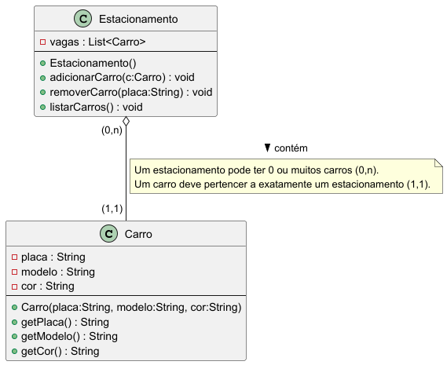

# Engenharia de Software 💻 — Prof. Betoti 👨‍🏫
---

## Atividades de 1 a 6

### 📑 Índice
1. [Comentários sobre o Livro Software Engineering at Google, O'Reilly](#comentarios-sobre-o-livro-software-engineering-at-google-oreilly)
   - [Trecho 1: O que é Engenharia de Software?](#trecho-1-o-que-e-engenharia-de-software)
   - [Trecho 2: Programação ao Longo do Tempo](#trecho-2-programacao-ao-longo-do-tempo)
2. [Exemplos de Trade-offs](#exemplos-de-trade-offs)
   - [1. Velocidade vs Qualidade](#1-velocidade-vs-qualidade)
   - [2. Escalabilidade vs Simplicidade](#2-escalabilidade-vs-simplicidade)
   - [3. Custo vs Manutenção](#3-custo-vs-manutencao)
3. [Tabela Resumo](#tabela-resumo)
4. [Conclusão](#conclusao)
5. [Diagramas e Classes](#diagramas-e-estudo-de-classes)

---

## 📌 Sobre o Projeto
Este repositório contém as atividades práticas da disciplina de Engenharia de Software, ministrada pelo Prof. Betoti na Fatec. O objetivo é explorar os conceitos apresentados no livro *Software Engineering at Google* (O'Reilly) por meio de reflexões teóricas, análise de trade-offs e implementações práticas. Um exemplo é o sistema de estacionamento modelado em Java, que inclui classes, testes unitários e modelagem UML, demonstrando a aplicação de boas práticas de engenharia de software. As atividades visam preparar os alunos para tomar decisões técnicas conscientes, considerando fatores como escalabilidade, qualidade e manutenção. O público-alvo inclui colegas de classe, o professor e potenciais recrutadores interessados em projetos acadêmicos que combinem teoria e prática.

---

## 📚 Comentários sobre o Livro *Software Engineering at Google*, O'Reilly

### 📖 Trecho 1: O que é Engenharia de Software?
O livro faz uma distinção clara entre “apenas programar” e **ser engenheiro de software**.  
- Programar é comparado a aprender a andar de bicicleta: uma habilidade útil, mas limitada.  
- Engenharia de software é como projetar uma ponte ou um avião, exigindo rigor, conhecimento teórico e responsabilidade.  
- Com o software presente em tudo — de smartphones a carros autônomos —, a necessidade de **boas práticas e confiabilidade** é crítica.

> “Engenheiros clássicos seguem regras rígidas para evitar que pontes desabem; no software, precisamos do mesmo nível de rigor.”

---

### ⏳ Trecho 2: Programação ao Longo do Tempo
Desenvolver software vai além de escrever um simples *Hello World*.  
Envolve a utilização de **ferramentas**, **processos** e **estratégias** para garantir a longevidade e a adaptabilidade do código. O livro destaca três pilares fundamentais:

1. **Tempo e Mudança** — como o código pode se adaptar a mudanças ao longo do tempo.  
2. **Escala e Crescimento** — como gerenciar sistemas que crescem exponencialmente.  
3. **Trade-offs e Custos** — como tomar decisões equilibradas considerando custos e benefícios.

💡 **Reflexão:** Engenharia de software combina técnica com estratégia, exigindo uma visão de longo prazo.

---

## ⚖️ Exemplos de Trade-offs

### 1️⃣ Velocidade vs Qualidade
**Descrição:**  
Priorizar entregas rápidas pode reduzir o tempo dedicado a testes, aumentando riscos de erros. Investir em qualidade exige mais tempo inicial, mas minimiza problemas futuros.

**Exemplos práticos:**
- **MVP com frameworks ágeis** → **Ruby on Rails** ou **Django** para lançamentos rápidos.  
- **Sistemas críticos** → **Java com Spring** ou **Go** para maior desempenho e segurança.  
- **Dívida técnica** → Ignorar testes pode acelerar entregas, mas eleva custos de manutenção.  
- [Estudo](https://arxiv.org/abs/2203.04374): código de baixa qualidade apresenta até 15× mais defeitos.

**Cenário Real:**  
O Twitter, em seu lançamento em 2006, priorizou velocidade para disponibilizar rapidamente um MVP. Isso resultou em instabilidades frequentes, simbolizadas pelo ícone “Fail Whale” durante sobrecargas. Com o tempo, a empresa investiu em refatorações para melhorar a qualidade e estabilidade, demonstrando como a dívida técnica pode impactar negativamente a manutenção.

---

### 2️⃣ Escalabilidade vs Simplicidade
**Descrição:**  
Soluções simples são mais rápidas de implementar, mas podem não suportar um crescimento massivo de usuários ou dados.

**Exemplos práticos:**
- **SQL (PostgreSQL, MySQL)** → Oferece consistência e robustez para sistemas menores.  
- **NoSQL (MongoDB, Cassandra)** → Proporciona escalabilidade horizontal e flexibilidade.  
- **Monolito** → Mais simples de desenvolver inicialmente.  
- **Microsserviços** → Mais complexos, mas ideais para escalabilidade.  
- [Caso Google](https://abseil.io/resources/swe-book/html/ch06.html): melhorias na qualidade dos resultados de busca aumentaram a latência, exigindo ajustes na arquitetura.

**Cenário Real:**  
O Netflix começou com uma arquitetura monolítica, simples e funcional para seus primeiros usuários. Com o crescimento global, migrou para microsserviços na nuvem AWS, o que aumentou a complexidade, mas permitiu escalar para milhões de usuários, lidando com picos de tráfego durante lançamentos de séries sem quedas significativas.

---

### 3️⃣ Custo vs Manutenção
**Descrição:**  
Escolhas de baixo custo inicial podem resultar em altos custos de manutenção no futuro, enquanto soluções prontas podem ser mais caras, mas oferecem suporte contínuo.

**Exemplos práticos:**
- **Build vs Buy**  
  - Build → Soluções open-source ou internas têm baixo custo inicial, mas demandam alta manutenção.  
  - Buy → SaaS ou APIs oferecem suporte e atualizações, mas com custo recorrente.  
  - [Exemplo real](https://aakashgupta.medium.com/the-product-leaders-guide-to-buying-vs-building-software-a67a87bfca04).  
- **Infraestrutura gerenciada vs autogerenciada**  
  - Serverless/PaaS (AWS Lambda, GCP App Engine) → Menos manutenção, maior custo unitário.  
  - IaaS (AWS EC2, GCP Compute Engine) → Mais controle, mas exige maior gerenciamento.

**Cenário Real:**  
O Dropbox inicialmente desenvolveu sua própria infraestrutura de armazenamento para reduzir custos. Com o aumento da escala, a manutenção tornou-se insustentável, levando à migração para o AWS S3, uma solução “buy” que reduziu a carga de gerenciamento, mas introduziu custos recorrentes previsíveis.

---

## 📊 Tabela Resumo

| Trade-off                   | Exemplo Rápido                                        | Consequência                                        |
|-----------------------------|-------------------------------------------------------|-----------------------------------------------------|
| Velocidade vs Qualidade     | MVP com Rails vs Go/Java + testes                     | Qualidade reduz custos de manutenção a longo prazo  |
| Escalabilidade vs Simplicidade | SQL vs NoSQL; Monolito vs Microsserviços            | Complexidade permite escala, mas exige mais esforço |
| Custo vs Manutenção         | Build (open-source) vs Buy (SaaS/API)                 | Build é econômico inicialmente, mas caro a longo prazo |
| Infraestrutura              | Serverless/PaaS vs IaaS                               | PaaS reduz manutenção, IaaS exige mais gestão       |

---

## 🎯 Conclusão
A leitura de *Software Engineering at Google* foi transformadora, destacando que a engenharia de software vai além da codificação, exigindo decisões estratégicas que equilibram trade-offs com base no contexto do projeto. A implementação do sistema de estacionamento me permitiu aplicar conceitos práticos como encapsulamento, testes unitários e modelagem UML, consolidando a importância de práticas rigorosas. Refletindo sobre projetos anteriores, percebi que priorizar velocidade sem qualidade muitas vezes resultou em refatorações demoradas, o que reforçou a necessidade de planejamento cuidadoso. Os trade-offs não são barreiras, mas sim ferramentas para moldar sistemas sustentáveis e escaláveis, e este projeto me ajudou a internalizar essa visão estratégica, essencial para minha formação como engenheiro de software.

📌 Mais detalhes no capítulo de trade-offs do  
[Software Engineering at Google](https://abseil.io/resources/swe-book/html/ch06.html)

---

## Diagramas e Estudo de Classes

### Diagrama UML para um estacionamento - 


### Classes para um estacionamento -  

#### Classe Carro
Essa classe representa um veículo no sistema de estacionamento, armazenando atributos como placa, modelo, cor e ano. Inclui métodos getters e setters para manipulação segura dos dados, além de sobrescrita de `toString()`, `equals()` e `hashCode()` para garantir exibição clara e comparação única pela placa.

```java
package fatec.gov.br.atividades.estacionamento;

import java.util.Objects;

public class Carro {
    private String placa;
    private String modelo;
    private String cor;
    private int ano;

    public Carro(String placa, String modelo, String cor, int ano) {
        this.placa = placa;
        this.modelo = modelo;
        this.cor = cor;
        this.ano = ano;
    }

    public String getPlaca() {
        return placa;
    }

    public void setPlaca(String placa) {
        this.placa = placa;
    }

    public String getModelo() {
        return modelo;
    }

    public void setModelo(String modelo) {
        this.modelo = modelo;
    }

    public String getCor() {
        return cor;
    }

    public void setCor(String cor) {
        this.cor = cor;
    }

    public int getAno() {
        return ano;
    }

    public void setAno(int ano) {
        this.ano = ano;
    }

    @Override
    public String toString() {
        return "Carro [placa=" + placa + ", modelo=" + modelo + ", cor=" + cor + ", ano=" + ano + "]";
    }

    @Override
    public boolean equals(Object o) {
        if (this == o) return true;
        if (!(o instanceof Carro)) return false;
        Carro carro = (Carro) o;
        return Objects.equals(placa, carro.placa);
    }

    @Override
    public int hashCode() {
        return Objects.hash(placa);
    }
}
```

#### Classe Estacionamento
Essa classe gerencia uma lista de carros usando uma `ArrayList`, permitindo operações como adicionar, remover e buscar veículos por placa. Utiliza Java Streams para buscas eficientes e reflete boas práticas de manipulação de coleções.

```java
package fatec.gov.br.atividades.estacionamento;

import java.util.ArrayList;
import java.util.List;

public class Estacionamento {
    private List<Carro> carros = new ArrayList<>();

    public void adicionarCarro(Carro carro) {
        carros.add(carro);
    }

    public boolean removerCarro(String placa) {
        return carros.removeIf(c -> c.getPlaca().equals(placa));
    }

    public Carro buscarCarro(String placa) {
        return carros.stream()
                     .filter(c -> c.getPlaca().equals(placa))
                     .findFirst()
                     .orElse(null);
    }

    public List<Carro> getCarros() {
        return carros;
    }
}
```

#### Teste JUnit
Esses testes unitários validam as funcionalidades principais da classe `Estacionamento`, verificando adição, remoção e busca de carros. As asserções do JUnit garantem o comportamento correto, reforçando a importância de testes automatizados para assegurar a qualidade do software.

```java
package fatec.gov.br.atividades.estacionamento;

import org.junit.jupiter.api.Test;
import static org.junit.jupiter.api.Assertions.*;

class Teste_Estacionamento {

    @Test
    void testAdicionarCarro() {
        Estacionamento est = new Estacionamento();
        est.adicionarCarro(new Carro("ABC1234", "Fusca", "Azul", 1976));
        assertEquals(1, est.getCarros().size());
    }

    @Test
    void testRemoverCarro() {
        Estacionamento est = new Estacionamento();
        est.adicionarCarro(new Carro("XYZ9876", "Civic", "Prata", 2020));
        boolean removido = est.removerCarro("XYZ9876");
        assertTrue(removido);
        assertEquals(0, est.getCarros().size());
    }

    @Test
    void testBuscarCarro() {
        Estacionamento est = new Estacionamento();
        Carro c = new Carro("AAA1111", "Corolla", "Preto", 2019);
        est.adicionarCarro(c);

        Carro encontrado = est.buscarCarro("AAA1111");
        assertNotNull(encontrado);
        assertEquals("Corolla", encontrado.getModelo());
    }
}
```

### Relatório de Teste - Surefire
📊 [Testes das classes - Surefire](https://ropcastr.github.io/Bertoti/surefire.html)


